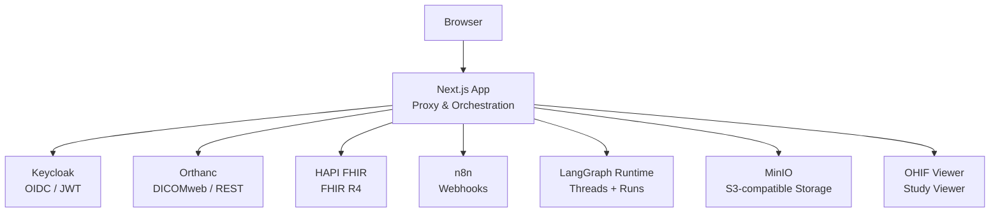
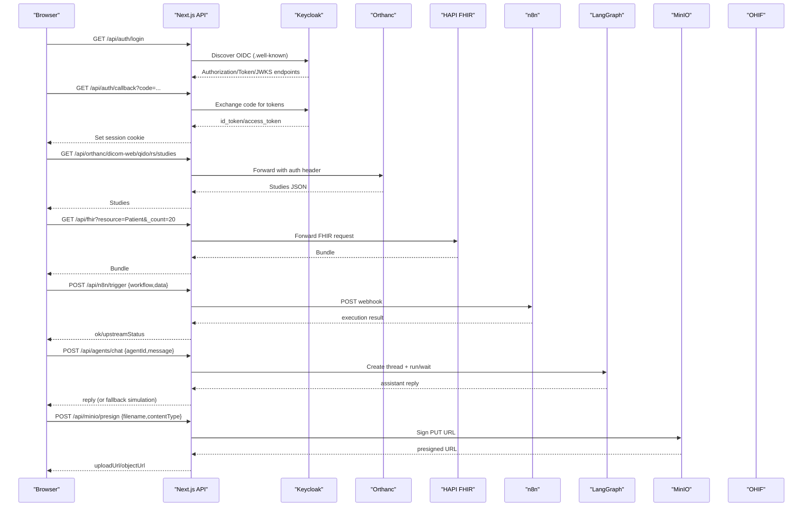
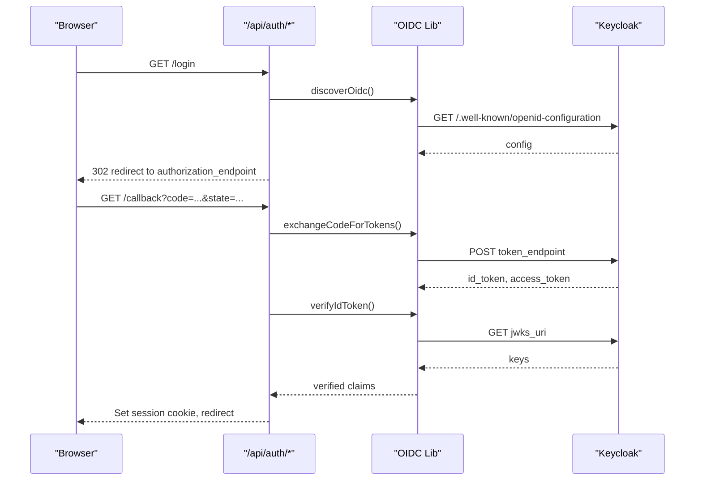
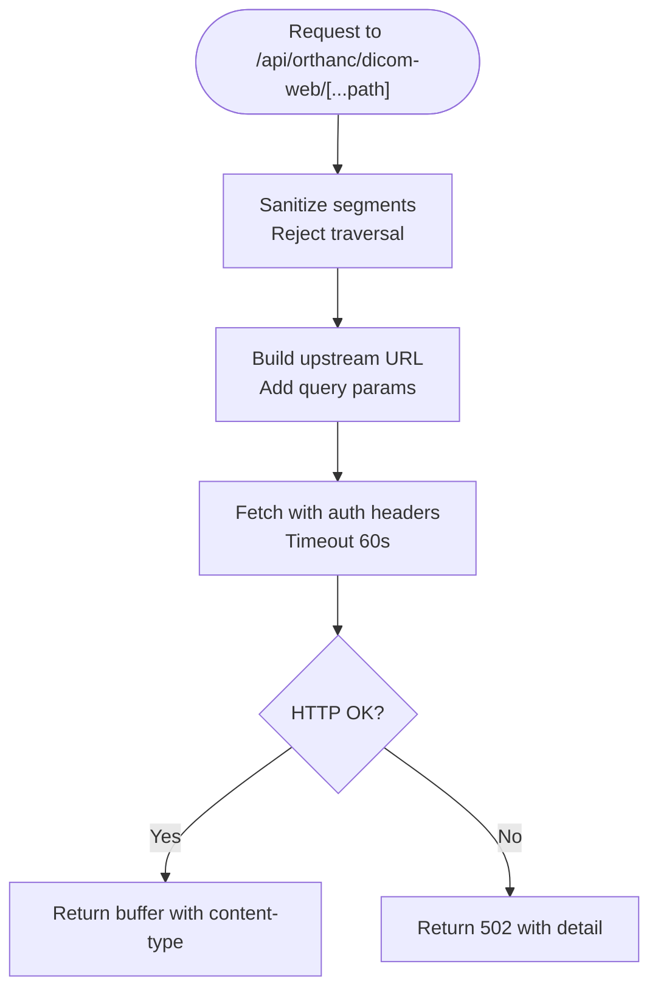
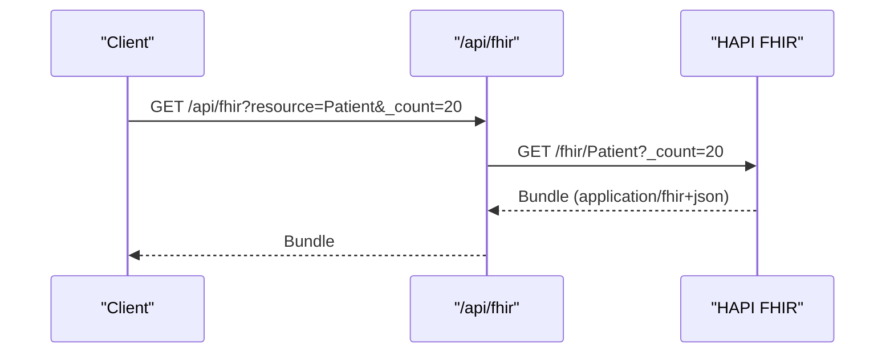
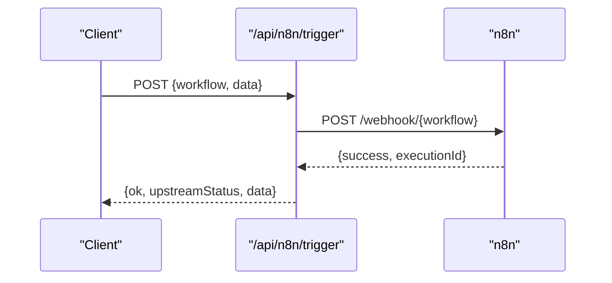
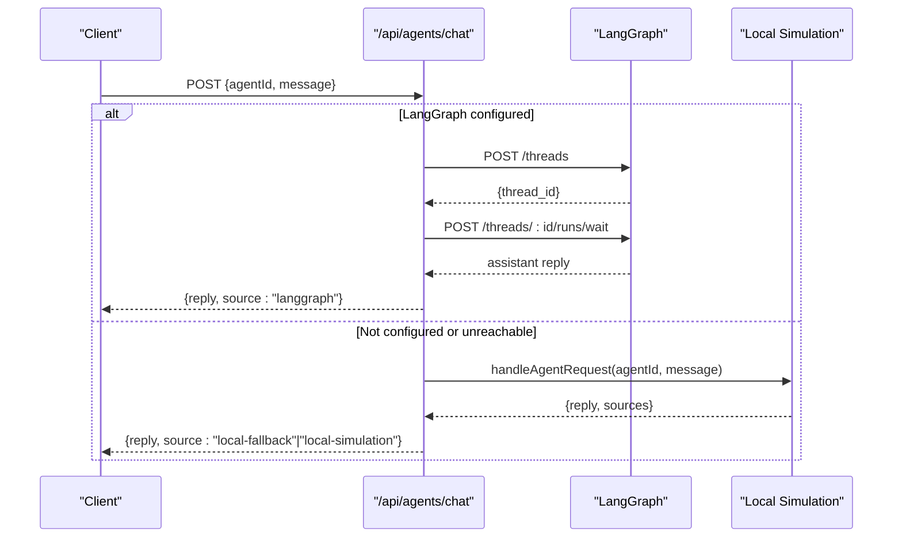
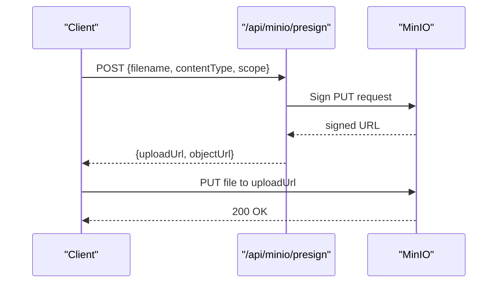
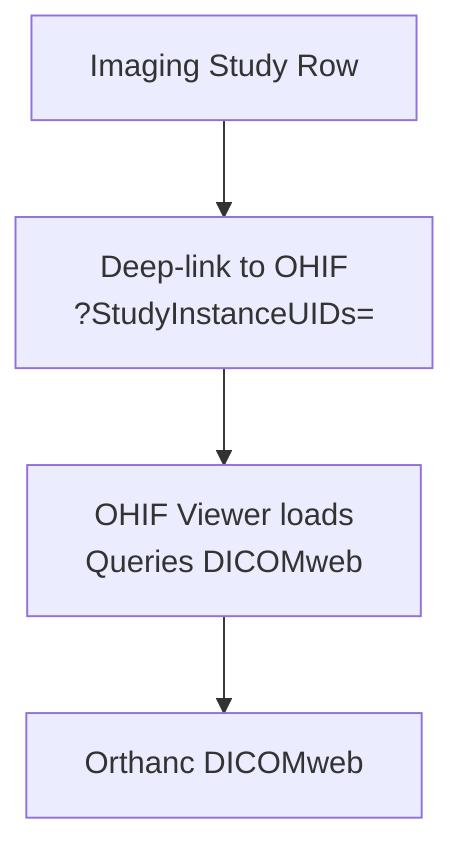
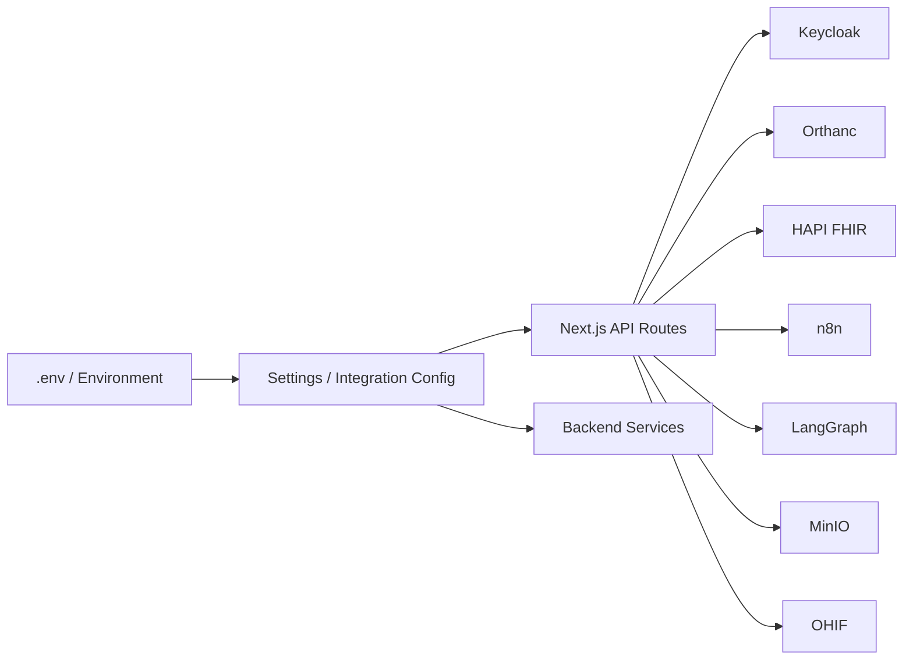

# Service Integrations

<cite>
**Referenced Files in This Document**
- [README.md](file://README.md)
- [docker-compose.yml](file://docker-compose.yml)
- [src/proxy.ts](file://src/proxy.ts)
- [src/app/api/auth/callback/route.ts](file://src/app/api/auth/callback/route.ts)
- [src/lib/auth/oidc.ts](file://src/lib/auth/oidc.ts)
- [services/keycloak.mjs](file://services/keycloak.mjs)
- [src/app/api/orthanc/proxy/route.ts](file://src/app/api/orthanc/proxy/route.ts)
- [src/app/api/orthanc/dicom-web/[...path]/route.ts](file://src/app/api/orthanc/dicom-web/%5B...path%5D/route.ts)
- [services/orthanc.json](file://services/orthanc.json)
- [src/app/api/fhir/route.ts](file://src/app/api/fhir/route.ts)
- [services/fhir.mjs](file://services/fhir.mjs)
- [src/app/api/n8n/trigger/route.ts](file://src/app/api/n8n/trigger/route.ts)
- [services/n8n.mjs](file://services/n8n.mjs)
- [src/app/agents/page.tsx](file://src/app/agents/page.tsx)
- [src/app/api/agents/chat/route.ts](file://src/app/api/agents/chat/route.ts)
- [services/langgraph_agent.py](file://services/langgraph_agent.py)
- [src/app/api/minio/presign/route.ts](file://src/app/api/minio/presign/route.ts)
- [src/app/api/minio/status/route.ts](file://src/app/api/minio/status/route.ts)
- [src/lib/integrations/minio.ts](file://src/lib/integrations/minio.ts)
- [backend/app/core/config.py](file://backend/app/core/config.py)
- [backend/app/core/integrations.py](file://backend/app/core/integrations.py)
</cite>

## Table of Contents
1. Introduction
2. Project Structure
3. Core Components
4. Architecture Overview
5. Detailed Component Analysis
6. Dependency Analysis
7. Performance Considerations
8. Troubleshooting Guide
9. Conclusion

## Introduction
This document explains how GeraldOS integrates with external services to provide secure, server-side proxying of sensitive operations while exposing safe APIs to the browser. It covers Keycloak OIDC authentication, Orthanc DICOM/PACS connectivity, HAPI FHIR interoperability, n8n workflow automation, LangGraph AI agent runtime, MinIO object storage, and OHIF medical image viewing. It also documents the proxy layer that keeps credentials server-side, integration patterns, error handling strategies, connection management, service discovery, configuration examples, authentication flows, and troubleshooting guidance for each integration point.

## Project Structure
GeraldOS is a Next.js application that orchestrates multiple backend services via environment-driven endpoints. The approved stack includes Postgres, Redis, MinIO, Orthanc, Keycloak, HAPI FHIR, Dicoogle, n8n, OHIF, and LangGraph. The platform exposes Next.js API routes that act as proxies or orchestration points, keeping secrets out of the browser.

**Diagram sources**
- [docker-compose.yml:41-110](file://docker-compose.yml#L41-L110)
- [README.md:11-23](file://README.md#L11-L23)

**Section sources**
- [README.md:1-121](file://README.md#L1-L121)
- [docker-compose.yml:1-118](file://docker-compose.yml#L1-L118)

## Core Components
- Proxy and Auth Guard: A middleware validates sessions and enforces access control, allowing degraded mode when Keycloak is not configured.
- Integration Manager: Centralized configuration and utilities for health checks, token verification, and cross-service calls.
- Service Proxies: API routes that forward requests to external services with sanitized paths, headers, timeouts, and error mapping.
- Client Config Exposure: Only non-secret configuration is exposed to the client for safe browser usage.

**Section sources**
- [src/proxy.ts:11-44](file://src/proxy.ts#L11-L44)
- [backend/app/core/integrations.py:9-35](file://backend/app/core/integrations.py#L9-L35)
- [README.md:66-89](file://README.md#L66-L89)

## Architecture Overview
The platform uses a server-side proxy pattern to keep credentials on the server. External services are discovered and accessed through typed configuration. Authentication flows use OIDC discovery and JWKS verification. Health and status endpoints report connected/unreachable/not_configured states with latency.

**Diagram sources**
- [src/lib/auth/oidc.ts:18-87](file://src/lib/auth/oidc.ts#L18-L87)
- [src/app/api/auth/callback/route.ts:13-44](file://src/app/api/auth/callback/route.ts#L13-L44)
- [src/app/api/orthanc/dicom-web/[...path]/route.ts:15-71](file://src/app/api/orthanc/dicom-web/%5B...path%5D/route.ts#L15-L71)
- [src/app/api/fhir/route.ts:10-38](file://src/app/api/fhir/route.ts#L10-L38)
- [src/app/api/n8n/trigger/route.ts:8-46](file://src/app/api/n8n/trigger/route.ts#L8-L46)
- [src/app/api/agents/chat/route.ts:8-84](file://src/app/api/agents/chat/route.ts#L8-L84)
- [src/app/api/minio/presign/route.ts:8-28](file://src/app/api/minio/presign/route.ts#L8-L28)

## Detailed Component Analysis

### Keycloak OIDC Authentication
- Discovery: The app discovers OIDC endpoints from the configured issuer and caches them.
- Authorization Flow: Redirects to Keycloak’s authorization endpoint; callback exchanges code for tokens and verifies id_token against JWKS.
- Session Management: Issues an httpOnly HS256 session cookie after successful login.
- Degraded Mode: When KEYCLOAK_URL is unset, the proxy bypasses auth so the platform remains usable during deployment.

**Diagram sources**
- [src/lib/auth/oidc.ts:18-87](file://src/lib/auth/oidc.ts#L18-L87)
- [src/app/api/auth/callback/route.ts:13-44](file://src/app/api/auth/callback/route.ts#L13-L44)
- [src/proxy.ts:11-44](file://src/proxy.ts#L11-L44)
- [services/keycloak.mjs:46-119](file://services/keycloak.mjs#L46-L119)

Configuration notes
- Configure KEYCLOAK_URL and realm/client IDs in environment variables.
- Ensure CORS and redirect URIs match the platform origin.

Error handling
- Invalid state or missing code redirects to login with an error message.
- Token exchange failures return HTTP errors propagated to the client.

**Section sources**
- [src/lib/auth/oidc.ts:18-87](file://src/lib/auth/oidc.ts#L18-L87)
- [src/app/api/auth/callback/route.ts:13-44](file://src/app/api/auth/callback/route.ts#L13-L44)
- [src/proxy.ts:11-44](file://src/proxy.ts#L11-L44)
- [services/keycloak.mjs:46-119](file://services/keycloak.mjs#L46-L119)

### Orthanc DICOM/PACS Connectivity
- DICOMweb Proxy: A catch-all route forwards QIDO-RS, WADO-RS, and STOW-RS requests to Orthanc with sanitized paths and appropriate headers.
- REST Proxy: A generic proxy accepts a parameterized path to call Orthanc REST endpoints safely.
- Configuration: Orthanc runs with DICOMweb enabled and optional authentication.

**Diagram sources**
- [src/app/api/orthanc/dicom-web/[...path]/route.ts:15-71](file://src/app/api/orthanc/dicom-web/%5B...path%5D/route.ts#L15-L71)
- [src/app/api/orthanc/proxy/route.ts:6-33](file://src/app/api/orthanc/proxy/route.ts#L6-L33)
- [services/orthanc.json:1-16](file://services/orthanc.json#L1-L16)

Configuration notes
- Set ORTHANC_URL to the running instance.
- Ensure DICOMweb plugin is enabled in Orthanc configuration.

Error handling
- Path traversal attempts return 400.
- Unreachable Orthanc returns 502 with details.

**Section sources**
- [src/app/api/orthanc/dicom-web/[...path]/route.ts:15-71](file://src/app/api/orthanc/dicom-web/%5B...path%5D/route.ts#L15-L71)
- [src/app/api/orthanc/proxy/route.ts:6-33](file://src/app/api/orthanc/proxy/route.ts#L6-L33)
- [services/orthanc.json:1-16](file://services/orthanc.json#L1-L16)

### HAPI FHIR Interoperability
- Proxy Pattern: The FHIR route forwards resource queries and metadata requests to HAPI FHIR with proper Accept headers.
- Resource Validation: Prevents path traversal and ensures only valid resource names are forwarded.

**Diagram sources**
- [src/app/api/fhir/route.ts:10-38](file://src/app/api/fhir/route.ts#L10-L38)
- [services/fhir.mjs:23-54](file://services/fhir.mjs#L23-L54)

Configuration notes
- Set FHIR_URL to the HAPI FHIR base.
- Use resource parameter to select the target resource type.

Error handling
- Invalid resource path returns 400.
- Unreachable FHIR returns 502 with details.

**Section sources**
- [src/app/api/fhir/route.ts:10-38](file://src/app/api/fhir/route.ts#L10-L38)
- [services/fhir.mjs:23-54](file://services/fhir.mjs#L23-L54)

### n8n Workflow Automation
- Outbound Trigger: The platform triggers n8n webhooks by POSTing to a constructed webhook URL with sanitized workflow names.
- Inbound Webhooks: Platform endpoints accept events from n8n and audit them.

**Diagram sources**
- [src/app/api/n8n/trigger/route.ts:8-46](file://src/app/api/n8n/trigger/route.ts#L8-L46)
- [services/n8n.mjs:20-41](file://services/n8n.mjs#L20-L41)

Configuration notes
- Set N8N_URL or configure webhookBase to point to the n8n instance.
- Whitelist allowed workflows by sanitizing input.

Error handling
- Missing workflow name returns 400.
- Unconfigured n8n returns 503.
- Unreachable n8n returns 502 with details.

**Section sources**
- [src/app/api/n8n/trigger/route.ts:8-46](file://src/app/api/n8n/trigger/route.ts#L8-L46)
- [services/n8n.mjs:20-41](file://services/n8n.mjs#L20-L41)

### LangGraph AI Agent Runtime
- Live Runtime: The chat endpoint creates a thread and waits for a run on the LangGraph Platform if configured.
- Fallback Behavior: If the runtime is unreachable or unconfigured, the platform falls back to live-data simulation using operational state.

**Diagram sources**
- [src/app/api/agents/chat/route.ts:8-84](file://src/app/api/agents/chat/route.ts#L8-L84)
- [src/app/agents/page.tsx:172-255](file://src/app/agents/page.tsx#L172-L255)
- [services/langgraph_agent.py:7-34](file://services/langgraph_agent.py#L7-L34)

Configuration notes
- Set LANGGRAPH_URL and optional API key to enable live runtime.
- Agents are selected by agentId; routing defaults to executive if unknown.

Error handling
- Thread creation or run failures fall through to local simulation.
- Status indicators reflect whether LangGraph is connected or simulated.

**Section sources**
- [src/app/api/agents/chat/route.ts:8-84](file://src/app/api/agents/chat/route.ts#L8-L84)
- [src/app/agents/page.tsx:172-255](file://src/app/agents/page.tsx#L172-L255)
- [services/langgraph_agent.py:7-34](file://services/langgraph_agent.py#L7-L34)

### MinIO Object Storage
- Presigned Uploads: The platform generates browser-safe presigned PUT URLs for direct uploads to MinIO without exposing credentials.
- Bucket Management: Ensures default bucket exists and lists buckets for health reporting.

**Diagram sources**
- [src/app/api/minio/presign/route.ts:8-28](file://src/app/api/minio/presign/route.ts#L8-L28)
- [src/lib/integrations/minio.ts:29-47](file://src/lib/integrations/minio.ts#L29-L47)
- [src/app/api/minio/status/route.ts:7-23](file://src/app/api/minio/status/route.ts#L7-L23)

Configuration notes
- Set MINIO_ENDPOINT, MINIO_ACCESS_KEY, MINIO_SECRET_KEY, and default bucket.
- Scope and filename are sanitized to prevent injection.

Error handling
- Unconfigured MinIO returns 503.
- Unreachable MinIO returns 502 with details.

**Section sources**
- [src/app/api/minio/presign/route.ts:8-28](file://src/app/api/minio/presign/route.ts#L8-L28)
- [src/lib/integrations/minio.ts:29-47](file://src/lib/integrations/minio.ts#L29-L47)
- [src/app/api/minio/status/route.ts:7-23](file://src/app/api/minio/status/route.ts#L7-L23)

### OHIF Medical Image Viewing
- Deep Linking: Study rows link to OHIF with StudyInstanceUIDs parameters.
- Local Mock: A simple mock viewer displays study context and DICOMweb endpoint information.

**Diagram sources**
- [README.md:73-78](file://README.md#L73-L78)
- [services/ohif.mjs:1-20](file://services/ohif.mjs#L1-L20)

Configuration notes
- Configure OHIF_URL to point to the production viewer.
- Ensure DICOMweb root is reachable from OHIF.

Error handling
- If DICOMweb is unreachable, OHIF will show loading errors; platform should surface status via health endpoints.

**Section sources**
- [README.md:73-78](file://README.md#L73-L78)
- [services/ohif.mjs:1-20](file://services/ohif.mjs#L1-L20)

## Dependency Analysis
The platform depends on environment-configured services. docker-compose defines the full stack, including health checks and ports. The backend configuration module centralizes settings for services like Keycloak, Orthanc, FHIR, MinIO, and more.

**Diagram sources**
- [docker-compose.yml:41-110](file://docker-compose.yml#L41-L110)
- [backend/app/core/config.py:4-19](file://backend/app/core/config.py#L4-L19)

**Section sources**
- [docker-compose.yml:1-118](file://docker-compose.yml#L1-L118)
- [backend/app/core/config.py:4-19](file://backend/app/core/config.py#L4-L19)

## Performance Considerations
- Timeouts: All outbound integrations use explicit timeouts to avoid hanging requests (e.g., 60s for DICOMweb, 12s for FHIR, 10s for n8n).
- Streaming: Large payloads (e.g., DICOM instances) are streamed as buffers to minimize memory pressure.
- Health Checks: docker-compose health checks ensure dependencies are ready before traffic starts.
- Caching: OIDC discovery results are cached to reduce repeated network calls.

[No sources needed since this section provides general guidance]

## Troubleshooting Guide
Common issues and resolutions per integration:

- Keycloak
  - Symptom: Login loop or invalid state.
  - Check: Verify KEYCLOAK_URL, redirect URI, and state cookie.
  - Action: Confirm OIDC discovery succeeds and JWKS is reachable.

- Orthanc
  - Symptom: 502 “Orthanc unreachable” or 400 “invalid proxy path”.
  - Check: ORTHANC_URL, DICOMweb plugin enabled, path sanitization rules.
  - Action: Validate segments do not contain traversal characters; ensure Orthanc is healthy.

- HAPI FHIR
  - Symptom: 400 “invalid resource path” or 502 “HAPI FHIR unreachable”.
  - Check: FHIR_URL and resource parameter; ensure Accept header is set.
  - Action: Correct resource name and confirm FHIR service is up.

- n8n
  - Symptom: 503 “not configured” or 502 “unreachable”.
  - Check: N8N_URL or webhookBase; workflow name sanitization.
  - Action: Provide a valid workflow name and ensure n8n webhook endpoint responds.

- LangGraph
  - Symptom: No live replies; fallback mode active.
  - Check: LANGGRAPH_URL and optional API key; thread/create and run/wait endpoints.
  - Action: Configure runtime; if unavailable, rely on local simulation for development.

- MinIO
  - Symptom: 503 “not configured” or 502 “unreachable”.
  - Check: MINIO_ENDPOINT, credentials, default bucket existence.
  - Action: Ensure bucket exists and credentials are correct; presigned URLs must be used for uploads.

- OHIF
  - Symptom: Viewer cannot load studies.
  - Check: DICOMweb root accessibility and StudyInstanceUIDs parameter.
  - Action: Verify Orthanc DICOMweb is reachable and OHIF is configured correctly.

**Section sources**
- [src/app/api/orthanc/dicom-web/[...path]/route.ts:24-33](file://src/app/api/orthanc/dicom-web/%5B...path%5D/route.ts#L24-L33)
- [src/app/api/fhir/route.ts:19-21](file://src/app/api/fhir/route.ts#L19-L21)
- [src/app/api/n8n/trigger/route.ts:11-19](file://src/app/api/n8n/trigger/route.ts#L11-L19)
- [src/app/api/minio/presign/route.ts:9-12](file://src/app/api/minio/presign/route.ts#L9-L12)
- [src/lib/auth/oidc.ts:18-29](file://src/lib/auth/oidc.ts#L18-L29)

## Conclusion
GeraldOS integrates external services through a secure, server-side proxy architecture that keeps credentials off the browser and exposes safe APIs. Each integration follows consistent patterns: configuration via environment variables, sanitized inputs, timeouts, and standardized error responses. Health and status endpoints provide visibility into service connectivity. The platform supports both live external services and local simulations for development, ensuring resilience and usability across environments.