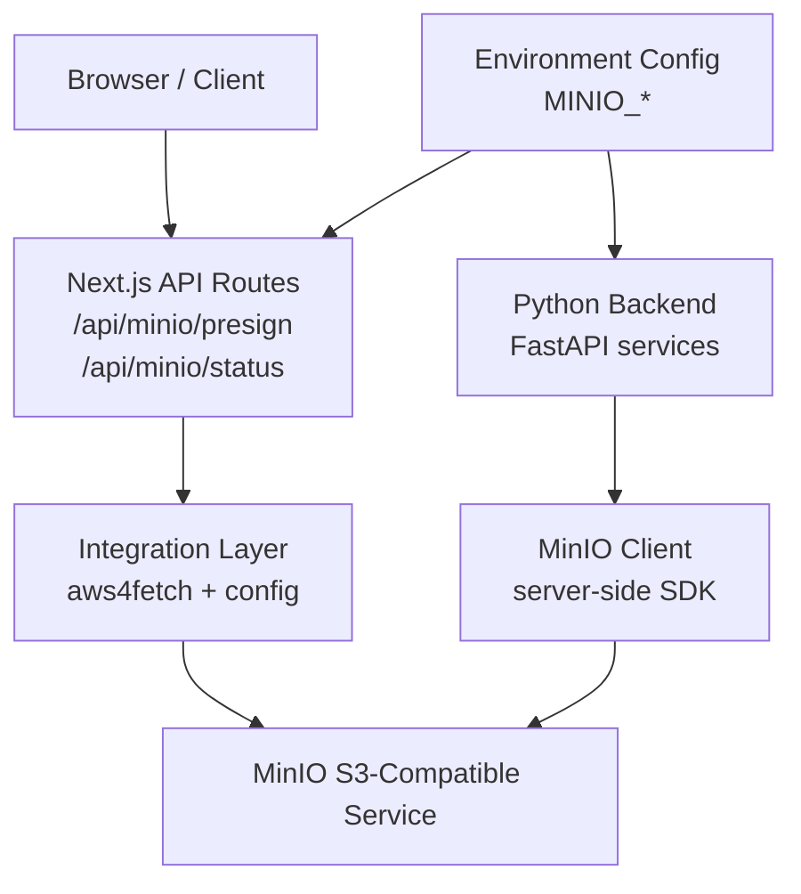
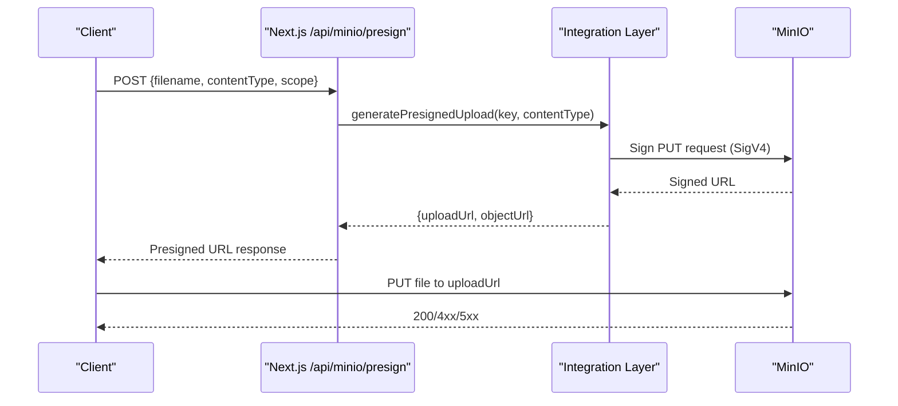
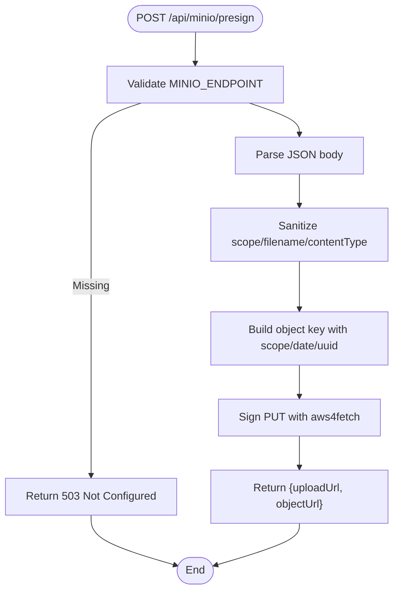
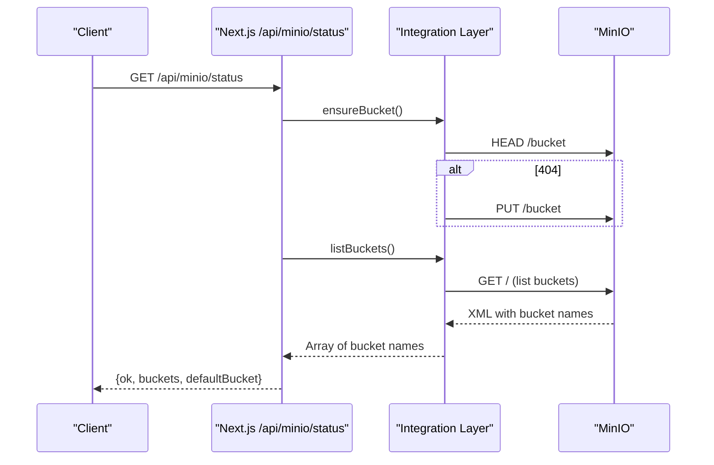
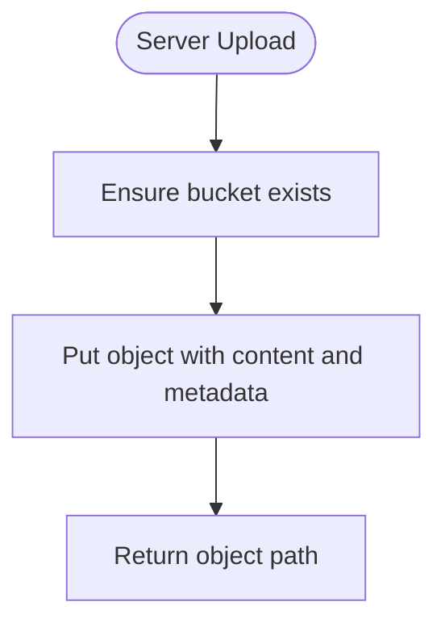
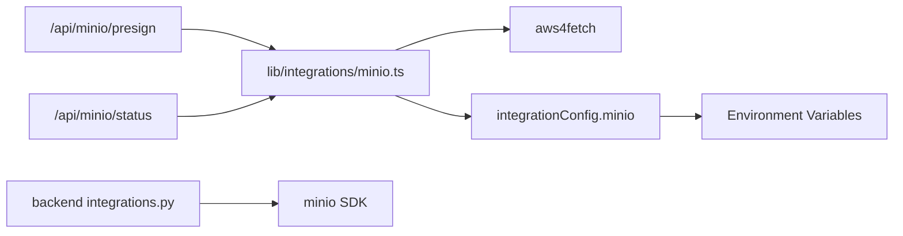

# Storage Integration (MinIO)

<cite>
**Referenced Files in This Document**
- [minio.ts](file://src/lib/integrations/minio.ts)
- [index.ts](file://src/lib/integrations/index.ts)
- [presign route](file://src/app/api/minio/presign/route.ts)
- [status route](file://src/app/api/minio/status/route.ts)
- [integrations.py](file://backend/app/core/integrations.py)
- [config.py](file://backend/app/core/config.py)
- [docker-compose.yml](file://docker-compose.yml)
</cite>

## Table of Contents
1. [Introduction](#introduction)
2. [Project Structure](#project-structure)
3. [Core Components](#core-components)
4. [Architecture Overview](#architecture-overview)
5. [Detailed Component Analysis](#detailed-component-analysis)
6. [Dependency Analysis](#dependency-analysis)
7. [Performance Considerations](#performance-considerations)
8. [Troubleshooting Guide](#troubleshooting-guide)
9. [Conclusion](#conclusion)

## Introduction
This document explains how the application integrates with MinIO object storage for secure file uploads, downloads via presigned URLs, bucket management, and metadata handling. It covers both the Next.js server-side integration (for presigning and health checks) and the Python backend integration (for direct server-to-storage operations). You will find workflows for uploading documents and images, bulk operations patterns, error handling strategies, and performance guidance for large files and concurrent access.

## Project Structure
The MinIO integration spans several layers:
- Next.js API routes expose endpoints to generate presigned upload URLs and check storage status.
- A shared integration module provides AWS SigV4 signing using aws4fetch against a configured MinIO endpoint.
- The Python backend includes a MinIO client for server-side uploads and bucket management.
- Docker Compose provisions a MinIO service with persistent volumes and health checks.

**Diagram sources**
- [presign route:1-29](file://src/app/api/minio/presign/route.ts#L1-L29)
- [status route:1-24](file://src/app/api/minio/status/route.ts#L1-L24)
- [minio.ts:1-59](file://src/lib/integrations/minio.ts#L1-L59)
- [integrations.py:1-119](file://backend/app/core/integrations.py#L1-L119)
- [config.py:1-20](file://backend/app/core/config.py#L1-L20)
- [docker-compose.yml:27-39](file://docker-compose.yml#L27-L39)

**Section sources**
- [presign route:1-29](file://src/app/api/minio/presign/route.ts#L1-L29)
- [status route:1-24](file://src/app/api/minio/status/route.ts#L1-L24)
- [minio.ts:1-59](file://src/lib/integrations/minio.ts#L1-L59)
- [integrations.py:1-119](file://backend/app/core/integrations.py#L1-L119)
- [config.py:1-20](file://backend/app/core/config.py#L1-L20)
- [docker-compose.yml:27-39](file://docker-compose.yml#L27-L39)

## Core Components
- Presigned Upload Generation: Server signs a PUT request to MinIO so clients can upload directly without exposing credentials.
- Bucket Management: Ensure default bucket exists and list buckets for health/status reporting.
- Server-Side Uploads: Python backend writes objects directly to MinIO for internal reports or processing artifacts.
- Configuration: Centralized environment-driven configuration for endpoint, credentials, bucket, and region.

Key responsibilities:
- Validate configuration before any storage operation.
- Enforce safe key naming and content-type handling.
- Provide timeouts and structured error responses.

**Section sources**
- [minio.ts:1-59](file://src/lib/integrations/minio.ts#L1-L59)
- [presign route:1-29](file://src/app/api/minio/presign/route.ts#L1-L29)
- [status route:1-24](file://src/app/api/minio/status/route.ts#L1-L24)
- [integrations.py:103-119](file://backend/app/core/integrations.py#L103-L119)
- [index.ts:42-48](file://src/lib/integrations/index.ts#L42-L48)

## Architecture Overview
The system uses a hybrid approach:
- Browser-based uploads use presigned URLs generated by the Next.js API. This avoids routing large payloads through the server and reduces bandwidth usage.
- Server-side uploads are used for background jobs or when the client cannot safely handle direct uploads.

**Diagram sources**
- [presign route:8-28](file://src/app/api/minio/presign/route.ts#L8-L28)
- [minio.ts:29-47](file://src/lib/integrations/minio.ts#L29-L47)

**Section sources**
- [presign route:8-28](file://src/app/api/minio/presign/route.ts#L8-L28)
- [minio.ts:29-47](file://src/lib/integrations/minio.ts#L29-L47)

## Detailed Component Analysis

### Presigned Upload Workflow
- Input validation: Sanitizes filename and scope; defaults to a safe content type if not provided.
- Key construction: Organizes objects under a scoped path with date partitioning and unique identifiers.
- Signing: Uses AWS SigV4 to sign a PUT request to the target object URL.
- Response: Returns both the upload URL and the eventual object URL for reference.

**Diagram sources**
- [presign route:8-28](file://src/app/api/minio/presign/route.ts#L8-L28)
- [minio.ts:29-47](file://src/lib/integrations/minio.ts#L29-L47)

**Section sources**
- [presign route:8-28](file://src/app/api/minio/presign/route.ts#L8-L28)
- [minio.ts:29-47](file://src/lib/integrations/minio.ts#L29-L47)

### Bucket Management and Health Status
- Ensure bucket: Checks existence via HEAD; creates it on 404 using PUT.
- List buckets: Lists all buckets by parsing the XML response from the root endpoint.
- Status endpoint: Exposes whether MinIO is reachable and returns discovered buckets plus the configured default bucket.

**Diagram sources**
- [status route:7-23](file://src/app/api/minio/status/route.ts#L7-L23)
- [minio.ts:15-27](file://src/lib/integrations/minio.ts#L15-L27)
- [minio.ts:49-59](file://src/lib/integrations/minio.ts#L49-L59)

**Section sources**
- [status route:7-23](file://src/app/api/minio/status/route.ts#L7-L23)
- [minio.ts:15-27](file://src/lib/integrations/minio.ts#L15-L27)
- [minio.ts:49-59](file://src/lib/integrations/minio.ts#L49-L59)

### Server-Side Uploads (Python Backend)
- Directly uploads bytes to MinIO using the official SDK.
- Ensures the target bucket exists before writing.
- Returns the resulting object location for tracking.

**Diagram sources**
- [integrations.py:103-119](file://backend/app/core/integrations.py#L103-L119)

**Section sources**
- [integrations.py:103-119](file://backend/app/core/integrations.py#L103-L119)

### Configuration and Security
- Environment variables define endpoint, credentials, bucket name, and region.
- Credentials never leave the server; only signed URLs are sent to clients.
- Public client configuration exposes only non-secret flags for feature toggles.

**Section sources**
- [index.ts:42-48](file://src/lib/integrations/index.ts#L42-L48)
- [config.py:7-9](file://backend/app/core/config.py#L7-L9)
- [docker-compose.yml:27-39](file://docker-compose.yml#L27-L39)

## Dependency Analysis
- Next.js API routes depend on the integration layer for MinIO operations.
- The integration layer depends on aws4fetch for SigV4 signing and environment configuration.
- Python backend depends on the MinIO SDK for server-side operations.
- Docker Compose orchestrates MinIO alongside other services and persists data.

**Diagram sources**
- [presign route:1-29](file://src/app/api/minio/presign/route.ts#L1-L29)
- [status route:1-24](file://src/app/api/minio/status/route.ts#L1-L24)
- [minio.ts:1-59](file://src/lib/integrations/minio.ts#L1-L59)
- [integrations.py:1-119](file://backend/app/core/integrations.py#L1-L119)
- [index.ts:42-48](file://src/lib/integrations/index.ts#L42-L48)

**Section sources**
- [presign route:1-29](file://src/app/api/minio/presign/route.ts#L1-L29)
- [status route:1-24](file://src/app/api/minio/status/route.ts#L1-L24)
- [minio.ts:1-59](file://src/lib/integrations/minio.ts#L1-L59)
- [integrations.py:1-119](file://backend/app/core/integrations.py#L1-L119)
- [index.ts:42-48](file://src/lib/integrations/index.ts#L42-L48)

## Performance Considerations
- Direct browser uploads via presigned URLs minimize server load and network hops.
- Timeouts:
  - Integration layer uses AbortSignal timeouts for health and listing calls.
  - Configure appropriate timeouts based on network conditions and file sizes.
- Concurrency:
  - Clients can perform multiple parallel uploads to different keys; avoid excessive concurrency that may overwhelm MinIO or client resources.
- Large files:
  - Use multipart uploads at the client side if supported by your upload library.
  - Ensure correct Content-Type headers are set during upload to preserve metadata.
- Caching and CDN:
  - For frequent reads, consider caching public objects behind a CDN or reverse proxy.
- Monitoring:
  - Use the status endpoint to detect connectivity issues early and surface them to users.

[No sources needed since this section provides general guidance]

## Troubleshooting Guide
Common issues and resolutions:
- Not configured:
  - Symptom: 503 responses indicating missing MINIO_ENDPOINT.
  - Action: Set MINIO_ENDPOINT and related environment variables.
- Unreachable storage:
  - Symptom: 502 responses with “MinIO unreachable” or connection errors.
  - Action: Verify MinIO service health and network reachability; check firewall rules and DNS.
- Permission errors:
  - Symptom: 403 responses from MinIO during upload/download.
  - Action: Confirm access keys, secret keys, and bucket policies allow the intended operations.
- Network timeouts:
  - Symptom: Requests abort due to timeout.
  - Action: Increase timeouts for large transfers or adjust network settings.
- Bucket not found:
  - Symptom: 404 when accessing bucket.
  - Action: Use the status endpoint to auto-create the bucket or create it manually.

Operational tips:
- Use /api/minio/status to validate connectivity and discover available buckets.
- Inspect error messages returned by the API for detailed diagnostics.
- Log failed uploads with their keys and scopes to aid investigation.

**Section sources**
- [presign route:8-28](file://src/app/api/minio/presign/route.ts#L8-L28)
- [status route:7-23](file://src/app/api/minio/status/route.ts#L7-L23)
- [minio.ts:15-27](file://src/lib/integrations/minio.ts#L15-L27)
- [minio.ts:49-59](file://src/lib/integrations/minio.ts#L49-L59)

## Conclusion
The MinIO integration provides a robust, secure, and scalable foundation for object storage within the platform. Presigned URLs enable efficient client-side uploads while preserving security and reducing server overhead. The status endpoint offers operational visibility, and the Python backend supports server-side workflows where necessary. By following the recommended practices for configuration, error handling, and performance tuning, teams can reliably manage documents, images, and bulk file operations across diverse environments.

[No sources needed since this section summarizes without analyzing specific files]