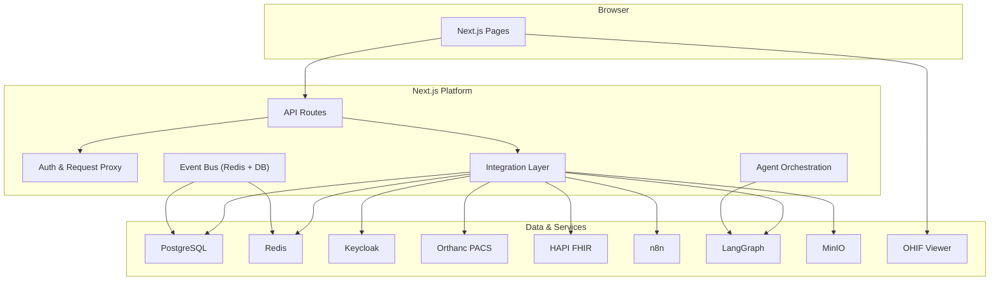
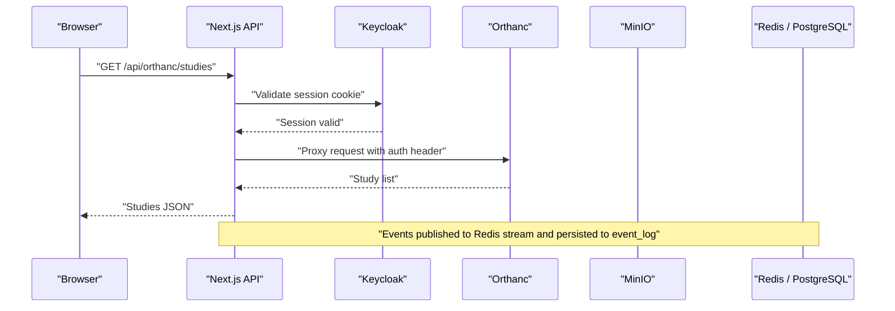
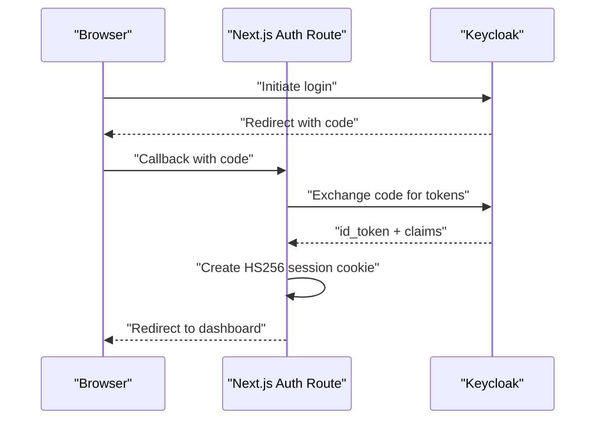
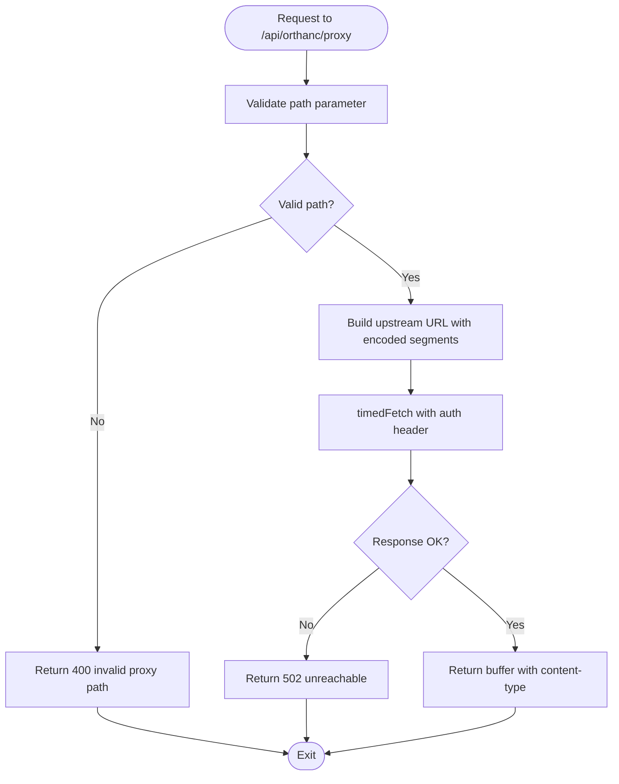
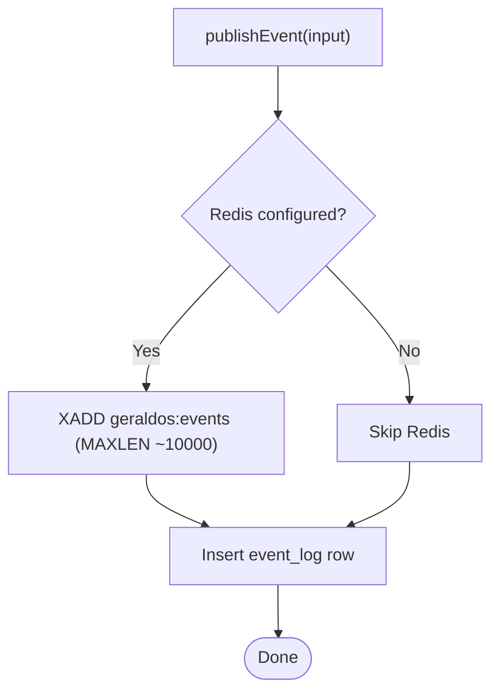
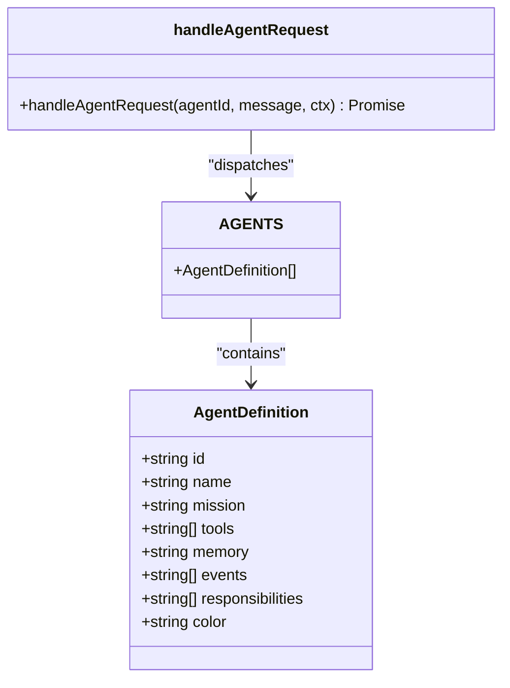
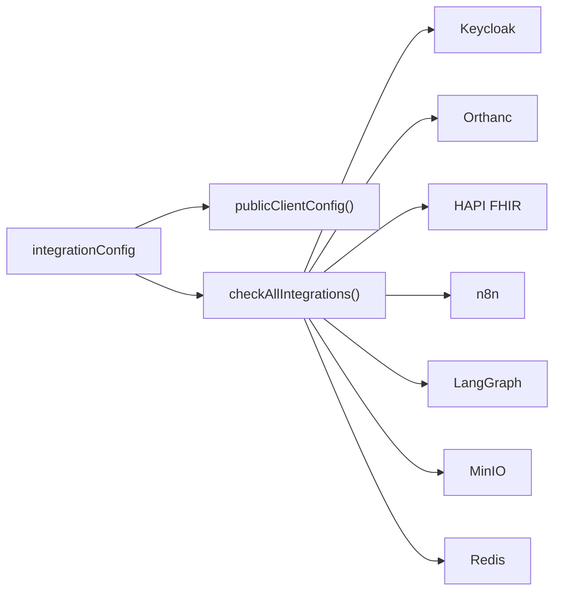
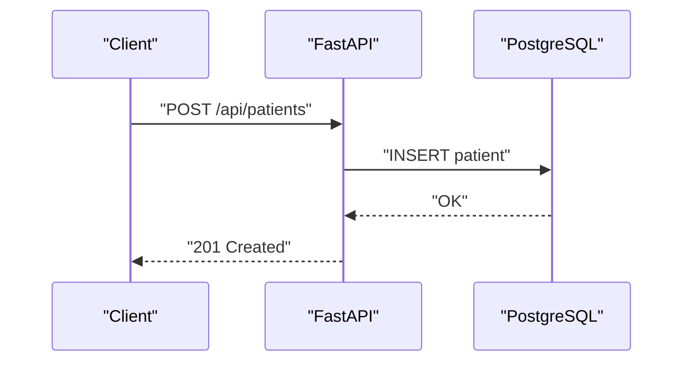
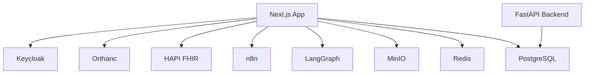

# System Architecture

<cite>
**Referenced Files in This Document**
- [README.md](file://README.md)
- [docker-compose.yml](file://docker-compose.yml)
- [package.json](file://package.json)
- [src/app/layout.tsx](file://src/app/layout.tsx)
- [src/proxy.ts](file://src/proxy.ts)
- [src/lib/integrations/index.ts](file://src/lib/integrations/index.ts)
- [src/lib/events.ts](file://src/lib/events.ts)
- [src/lib/agents.ts](file://src/lib/agents.ts)
- [src/app/api/auth/callback/route.ts](file://src/app/api/auth/callback/route.ts)
- [src/app/api/orthanc/proxy/route.ts](file://src/app/api/orthanc/proxy/route.ts)
- [backend/app/main.py](file://backend/app/main.py)
- [backend/app/core/config.py](file://backend/app/core/config.py)
- [drizzle/0000_redundant_the_twelve.sql](file://drizzle/0000_redundant_the_twelve.sql)
</cite>

## Table of Contents
1. Introduction
2. Project Structure
3. Core Components
4. Architecture Overview
5. Detailed Component Analysis
6. Dependency Analysis
7. Performance Considerations
8. Troubleshooting Guide
9. Conclusion
10. Appendices

## Introduction
GeraldOS is an AI-native diagnostic imaging operations platform that orchestrates healthcare workflows above the imaging stack. It centralizes patient, scheduling, workflow, equipment, inventory, reporting, and AI agent capabilities while delegating specialized tasks to dedicated services: Keycloak for identity, Orthanc for PACS/DICOMweb, HAPI FHIR for clinical interoperability, n8n for automation, LangGraph for AI agents, OHIF/Weasis for viewers, MinIO for object storage, and Redis for event streaming and queues. The Next.js frontend provides the user interface; server-side API routes act as a secure proxy layer that keeps credentials off the browser and exposes safe APIs.

## Project Structure
The repository is organized into:
- Frontend and API routes under src/app with Next.js App Router
- Shared libraries for integrations, events, agents, and utilities under src/lib
- A FastAPI backend module under backend/app exposing additional operational endpoints
- Docker Compose orchestration for all runtime services
- Database migrations and schema under drizzle
- Service scripts and configuration under services and docker directories

**Diagram sources**
- [src/app/layout.tsx:13-22](file://src/app/layout.tsx#L13-L22)
- [src/proxy.ts:11-44](file://src/proxy.ts#L11-L44)
- [src/lib/integrations/index.ts:8-52](file://src/lib/integrations/index.ts#L8-L52)
- [src/lib/events.ts:101-131](file://src/lib/events.ts#L101-L131)
- [docker-compose.yml:4-110](file://docker-compose.yml#L4-L110)

**Section sources**
- [README.md:9-23](file://README.md#L9-L23)
- [docker-compose.yml:4-110](file://docker-compose.yml#L4-L110)
- [package.json:14-45](file://package.json#L14-L45)

## Core Components
- Identity and access control via Keycloak OIDC with HS256 session cookies issued by the platform
- Secure proxy layer that validates sessions and forwards requests to downstream services without exposing secrets to the browser
- Event-driven architecture using Redis Streams with durable fallback to PostgreSQL event_log
- Specialized AI agents with clear missions, tools, memory scope, and event subscriptions
- Integration health monitoring across all connected services
- Object storage via MinIO with presigned URLs for direct browser uploads
- PACS integration through Orthanc with sanitized REST proxying and DICOMweb support
- Clinical data interoperability via HAPI FHIR proxy endpoints
- Automation triggers and webhooks via n8n
- AI agent runtime via LangGraph with graceful fallback to local simulation

**Section sources**
- [src/app/api/auth/callback/route.ts:13-59](file://src/app/api/auth/callback/route.ts#L13-L59)
- [src/proxy.ts:11-44](file://src/proxy.ts#L11-L44)
- [src/lib/events.ts:18-60](file://src/lib/events.ts#L18-L60)
- [src/lib/agents.ts:41-177](file://src/lib/agents.ts#L41-L177)
- [src/lib/integrations/index.ts:134-266](file://src/lib/integrations/index.ts#L134-L266)

## Architecture Overview
GeraldOS sits above the imaging stack and orchestrates operations while delegating domain-specific responsibilities to specialized services. The Next.js application acts as both UI and secure API gateway. All sensitive credentials remain server-side; the browser only receives whitelisted configuration.

**Diagram sources**
- [src/app/api/orthanc/proxy/route.ts:7-33](file://src/app/api/orthanc/proxy/route.ts#L7-L33)
- [src/proxy.ts:30-43](file://src/proxy.ts#L30-L43)
- [src/lib/events.ts:101-131](file://src/lib/events.ts#L101-L131)

## Detailed Component Analysis

### Authentication and Session Management
- OIDC flow: discovery, code exchange, id_token verification, role extraction, and HS256 session cookie issuance
- Degraded mode when Keycloak is not configured, allowing development usage
- Middleware enforces authentication on API routes and redirects unauthenticated users

**Diagram sources**
- [src/app/api/auth/callback/route.ts:13-59](file://src/app/api/auth/callback/route.ts#L13-L59)
- [src/proxy.ts:11-44](file://src/proxy.ts#L11-L44)

**Section sources**
- [src/app/api/auth/callback/route.ts:13-59](file://src/app/api/auth/callback/route.ts#L13-L59)
- [src/proxy.ts:11-44](file://src/proxy.ts#L11-L44)
- [README.md:66-72](file://README.md#L66-L72)

### PACS Proxy and Imaging Workflow
- Sanitized proxy endpoint prevents path traversal and query injection
- Adds Orthanc authentication headers server-side
- Returns raw buffers with appropriate content types for DICOMweb clients
- Health checks and timeouts protect against upstream failures

**Diagram sources**
- [src/app/api/orthanc/proxy/route.ts:7-33](file://src/app/api/orthanc/proxy/route.ts#L7-L33)
- [src/lib/integrations/index.ts:71-78](file://src/lib/integrations/index.ts#L71-L78)

**Section sources**
- [src/app/api/orthanc/proxy/route.ts:7-33](file://src/app/api/orthanc/proxy/route.ts#L7-L33)
- [README.md:73-78](file://README.md#L73-L78)

### Event Bus and Auditability
- Centralized event types define domain events across modules
- publishEvent writes to Redis Streams (capped) and persists to event_log table
- List and count functions support command centre activity feed
- Graceful degradation ensures audit continuity even if Redis is down

**Diagram sources**
- [src/lib/events.ts:101-131](file://src/lib/events.ts#L101-L131)
- [src/lib/events.ts:18-60](file://src/lib/events.ts#L18-L60)

**Section sources**
- [src/lib/events.ts:18-60](file://src/lib/events.ts#L18-L60)
- [src/lib/events.ts:101-131](file://src/lib/events.ts#L101-L131)
- [README.md:96-97](file://README.md#L96-L97)

### Agent Orchestration and Decision Support
- Nine specialized agents with defined missions, tools, memory scopes, and event subscriptions
- Live-data snapshot aggregates operational state from PostgreSQL
- Dispatch logic returns decision support text; no direct state mutation
- When LangGraph is unreachable, local simulation reads current database state

**Diagram sources**
- [src/lib/agents.ts:30-39](file://src/lib/agents.ts#L30-L39)
- [src/lib/agents.ts:41-177](file://src/lib/agents.ts#L41-L177)
- [src/lib/agents.ts:216-220](file://src/lib/agents.ts#L216-L220)

**Section sources**
- [src/lib/agents.ts:41-177](file://src/lib/agents.ts#L41-L177)
- [src/lib/agents.ts:181-210](file://src/lib/agents.ts#L181-L210)
- [README.md:91-108](file://README.md#L91-L108)

### Integration Health and Client Configuration
- Central configuration holds service endpoints and secrets (server-side only)
- publicClientConfig exposes safe, non-secret settings to the browser
- checkAllIntegrations measures connectivity and latency for each service
- Timed fetch with timeouts protects against slow or hanging upstreams

**Diagram sources**
- [src/lib/integrations/index.ts:8-52](file://src/lib/integrations/index.ts#L8-L52)
- [src/lib/integrations/index.ts:134-266](file://src/lib/integrations/index.ts#L134-L266)

**Section sources**
- [src/lib/integrations/index.ts:8-52](file://src/lib/integrations/index.ts#L8-L52)
- [src/lib/integrations/index.ts:134-266](file://src/lib/integrations/index.ts#L134-L266)
- [README.md:84-89](file://README.md#L84-L89)

### Backend Operational Endpoints
- FastAPI module provides reception, scheduling, workflow, equipment, inventory, reporting, and analytics endpoints
- Uses SQLAlchemy with PostgreSQL for persistence
- Includes health check and CORS middleware

**Diagram sources**
- [backend/app/main.py:32-60](file://backend/app/main.py#L32-L60)
- [backend/app/core/config.py:4-19](file://backend/app/core/config.py#L4-L19)

**Section sources**
- [backend/app/main.py:25-325](file://backend/app/main.py#L25-L325)
- [backend/app/core/config.py:4-19](file://backend/app/core/config.py#L4-L19)

## Dependency Analysis
GeraldOS depends on multiple external services orchestrated via Docker Compose. The Next.js app consumes environment variables for endpoints and secrets, while the FastAPI backend also reads configuration similarly.

**Diagram sources**
- [docker-compose.yml:4-110](file://docker-compose.yml#L4-L110)
- [src/lib/integrations/index.ts:8-52](file://src/lib/integrations/index.ts#L8-L52)
- [backend/app/core/config.py:4-19](file://backend/app/core/config.py#L4-L19)

**Section sources**
- [docker-compose.yml:4-110](file://docker-compose.yml#L4-L110)
- [package.json:14-45](file://package.json#L14-L45)

## Performance Considerations
- Use timedFetch with short timeouts to prevent slow upstreams from blocking requests
- Cap Redis Streams to avoid unbounded growth and maintain performance
- Lazy-connect Redis clients with backoff to reduce reconnect storms
- Keep database queries efficient; leverage indexes where applicable
- Offload large file transfers to MinIO via presigned URLs to reduce server load
- Monitor integration latency and surface issues on the Dashboard

[No sources needed since this section provides general guidance]

## Troubleshooting Guide
- Authentication failures: verify Keycloak URL, realm, client configuration, and session cookie validity
- PACS connectivity: ensure Orthanc is reachable and credentials are set; check proxy path sanitization
- Event bus issues: confirm Redis availability; events still persist to event_log for audit continuity
- Integration health: use /api/integrations/status to inspect connected/unreachable/not_configured states with latency
- Storage errors: validate MinIO endpoint, credentials, and bucket existence; presign URLs should be generated server-side

**Section sources**
- [src/proxy.ts:11-44](file://src/proxy.ts#L11-L44)
- [src/app/api/orthanc/proxy/route.ts:7-33](file://src/app/api/orthanc/proxy/route.ts#L7-L33)
- [src/lib/events.ts:101-131](file://src/lib/events.ts#L101-L131)
- [src/lib/integrations/index.ts:134-266](file://src/lib/integrations/index.ts#L134-L266)
- [README.md:64-89](file://README.md#L64-L89)

## Conclusion
GeraldOS provides a secure, extensible, and AI-augmented operations platform for diagnostic imaging. By centralizing orchestration in Next.js and delegating specialized tasks to proven services, it balances usability, security, and scalability. The proxy layer protects credentials, the event bus ensures auditability, and the agent framework delivers decision support without autonomous execution. With robust health checks and graceful degradation, the platform remains resilient under partial outages.

[No sources needed since this section summarizes without analyzing specific files]

## Appendices

### Infrastructure Requirements
- PostgreSQL for persistent data and audit logs
- Redis for event streaming and queues
- MinIO for object storage with presigned upload URLs
- Keycloak for OIDC-based identity and roles
- Orthanc for PACS and DICOMweb
- HAPI FHIR for clinical interoperability
- n8n for automation and webhook handling
- LangGraph for AI agent runtime with fallback behavior
- OHIF/Weasis for image viewing deep links

**Section sources**
- [docker-compose.yml:4-110](file://docker-compose.yml#L4-L110)
- [README.md:9-23](file://README.md#L9-L23)

### Deployment Topology
- Single-node Docker Compose bundle for development and small deployments
- Environment-driven configuration allows multi-environment deployments
- Services can be scaled independently based on workload (e.g., Redis, Postgres, Orthanc)

**Section sources**
- [docker-compose.yml:1-118](file://docker-compose.yml#L1-L118)
- [README.md:47-64](file://README.md#L47-L64)

### Security Notes
- All credentials stay server-side; browser receives only safe config
- Sessions are httpOnly, sameSite=lax HS256 JWTs
- Webhook endpoints accept JSON only and write audit rows
- Proxy endpoints sanitize paths and enforce timeouts

**Section sources**
- [README.md:115-121](file://README.md#L115-L121)
- [src/proxy.ts:11-44](file://src/proxy.ts#L11-L44)
- [src/app/api/orthanc/proxy/route.ts:7-33](file://src/app/api/orthanc/proxy/route.ts#L7-L33)

### Data Model Highlights
- Core entities include patients, appointments, workflow studies, reports, equipment, inventory, invoices, knowledge documents, AI observations/recommendations, and event logs
- Foreign keys link workflow, finance, and quality domains for traceability

**Section sources**
- [drizzle/0000_redundant_the_twelve.sql:1-470](file://drizzle/0000_redundant_the_twelve.sql#L1-L470)