# Technology Stack

<cite>
**Referenced Files in This Document**
- [README.md](file://README.md)
- [docker-compose.yml](file://docker-compose.yml)
- [package.json](file://package.json)
- [tsconfig.json](file://tsconfig.json)
- [postcss.config.mjs](file://postcss.config.mjs)
- [drizzle.config.json](file://drizzle.config.json)
- [src/db/schema.ts](file://src/db/schema.ts)
- [backend/requirements.txt](file://backend/requirements.txt)
- [backend/app/main.py](file://backend/app/main.py)
- [services/langgraph_agent.py](file://services/langgraph_agent.py)
- [src/lib/events.ts](file://src/lib/events.ts)
- [src/app/api/events/stream/route.ts](file://src/app/api/events/stream/route.ts)
- [src/lib/auth/oidc.ts](file://src/lib/auth/oidc.ts)
- [src/app/api/auth/callback/route.ts](file://src/app/api/auth/callback/route.ts)
- [src/app/api/auth/login/route.ts](file://src/app/api/auth/login/route.ts)
- [src/app/api/auth/logout/route.ts](file://src/app/api/auth/logout/route.ts)
- [src/lib/integrations/minio.ts](file://src/lib/integrations/minio.ts)
- [src/app/api/minio/presign/route.ts](file://src/app/api/minio/presign/route.ts)
- [src/app/api/minio/status/route.ts](file://src/app/api/minio/status/route.ts)
- [ohif-config/app-config.js](file://ohif-config/app-config.js)
- [services/orthanc.json](file://services/orthanc.json)
</cite>

## Table of Contents
1. Introduction
2. Project Structure
3. Core Components
4. Architecture Overview
5. Detailed Component Analysis
6. Dependency Analysis
7. Performance Considerations
8. Troubleshooting Guide
9. Conclusion
10. Appendices

## Introduction
GeraldOS is an AI-native diagnostic imaging operations platform that orchestrates patient, scheduling, workflow, equipment, inventory, reporting, and AI agents while delegating specialized tasks to external services: Orthanc PACS for DICOM storage, OHIF for image viewing, Keycloak for identity, HAPI FHIR for health data interoperability, n8n for automation, LangGraph for agent runtime, MinIO for object storage, PostgreSQL for relational data, and Redis for event streaming. The frontend is a Next.js application with React and TypeScript, styled via Tailwind CSS. The backend includes Next.js API routes and a Python FastAPI microservice for additional modules. Drizzle ORM manages the PostgreSQL schema.

## Project Structure
The repository is organized into:
- Frontend (Next.js app): src/app pages and API routes, UI components, database schema, integrations, and auth flows.
- Backend (FastAPI): modular endpoints for reception, scheduling, workflow, equipment, inventory, reporting, analytics.
- Services: configuration and scripts for Orthanc, OHIF, Keycloak, HAPI FHIR, n8n, LangGraph, and MinIO.
- Infrastructure: Docker Compose defines all services and their dependencies; Drizzle config points to PostgreSQL.

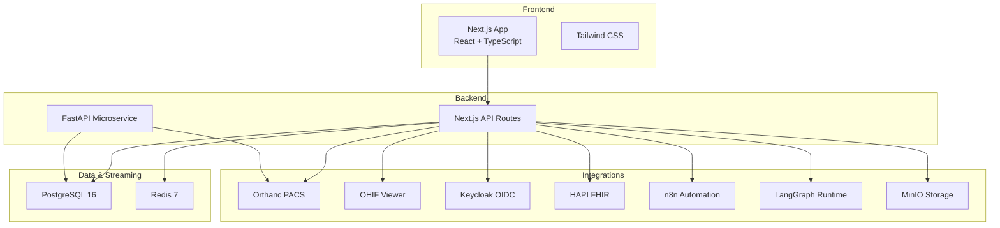

**Diagram sources**
- [docker-compose.yml:1-118](file://docker-compose.yml#L1-L118)
- [package.json:14-45](file://package.json#L14-L45)
- [drizzle.config.json:1-8](file://drizzle.config.json#L1-L8)

**Section sources**
- [README.md:9-23](file://README.md#L9-L23)
- [docker-compose.yml:1-118](file://docker-compose.yml#L1-L118)

## Core Components
- Frontend stack: Next.js 16, React 19, TypeScript, Tailwind CSS v4, Radix UI primitives, TanStack Query/Table, date-fns, recharts.
- Backend stack: Next.js API routes for orchestration; Python FastAPI microservice for dedicated modules using SQLAlchemy and httpx.
- Database: PostgreSQL 16 with Drizzle ORM schema and migrations; module-scoped schemas defined in SQL init script.
- Eventing: Redis Streams for real-time events with durable fallback to PostgreSQL event_log table; Server-Sent Events endpoint for live updates.
- Integrations:
  - Orthanc PACS with DICOMweb proxy and worklist plugins.
  - OHIF configured to use GeraldOS-proxied DICOMweb endpoints.
  - Keycloak OIDC for authentication with HS256 session cookies and role extraction.
  - HAPI FHIR R4 proxy for Patient/Imaging resources.
  - n8n webhooks for outbound triggers and inbound event ingestion.
  - LangGraph multi-agent graph for operational analysis.
  - MinIO S3-compatible storage with presigned uploads and bucket management.

**Section sources**
- [package.json:14-45](file://package.json#L14-L45)
- [backend/requirements.txt:1-17](file://backend/requirements.txt#L1-L17)
- [drizzle.config.json:1-8](file://drizzle.config.json#L1-L8)
- [src/db/schema.ts:1-468](file://src/db/schema.ts#L1-L468)
- [src/lib/events.ts:1-147](file://src/lib/events.ts#L1-L147)
- [src/app/api/events/stream/route.ts:1-93](file://src/app/api/events/stream/route.ts#L1-L93)
- [services/orthanc.json:1-16](file://services/orthanc.json#L1-L16)
- [ohif-config/app-config.js:1-49](file://ohif-config/app-config.js#L1-L49)
- [src/lib/auth/oidc.ts:1-95](file://src/lib/auth/oidc.ts#L1-L95)
- [src/lib/integrations/minio.ts:1-59](file://src/lib/integrations/minio.ts#L1-L59)

## Architecture Overview
GeraldOS uses a layered architecture:
- Presentation layer: Next.js SPA with React/TypeScript and Tailwind UI.
- Orchestration layer: Next.js API routes coordinate requests, handle auth, proxy integrations, and stream events.
- Processing layer: FastAPI microservice provides domain-specific endpoints (reception, scheduling, workflow, equipment, inventory, reporting, analytics).
- Data layer: PostgreSQL stores core entities and audit logs; Redis Streams provide low-latency event distribution with durability guarantees.
- Integration layer: Orthanc, OHIF, Keycloak, HAPI FHIR, n8n, LangGraph, MinIO are accessed server-side to keep secrets out of the browser.

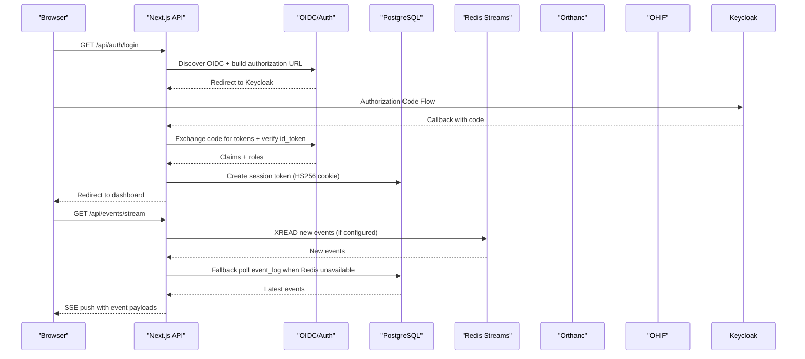

**Diagram sources**
- [src/app/api/auth/login/route.ts:1-30](file://src/app/api/auth/login/route.ts#L1-L30)
- [src/app/api/auth/callback/route.ts:1-44](file://src/app/api/auth/callback/route.ts#L1-L44)
- [src/lib/auth/oidc.ts:1-95](file://src/lib/auth/oidc.ts#L1-L95)
- [src/lib/events.ts:1-147](file://src/lib/events.ts#L1-L147)
- [src/app/api/events/stream/route.ts:1-93](file://src/app/api/events/stream/route.ts#L1-L93)

## Detailed Component Analysis

### Frontend Stack (Next.js, React, TypeScript, Tailwind CSS)
- Next.js 16 serves both UI and API routes, enabling unified development and deployment.
- React 19 with TypeScript ensures type safety and modern component patterns.
- Tailwind CSS v4 with PostCSS plugin provides utility-first styling.
- Radix UI primitives offer accessible, composable UI building blocks.
- TanStack Query and Table streamline data fetching and tabular displays.
- Recharts supports analytics dashboards.

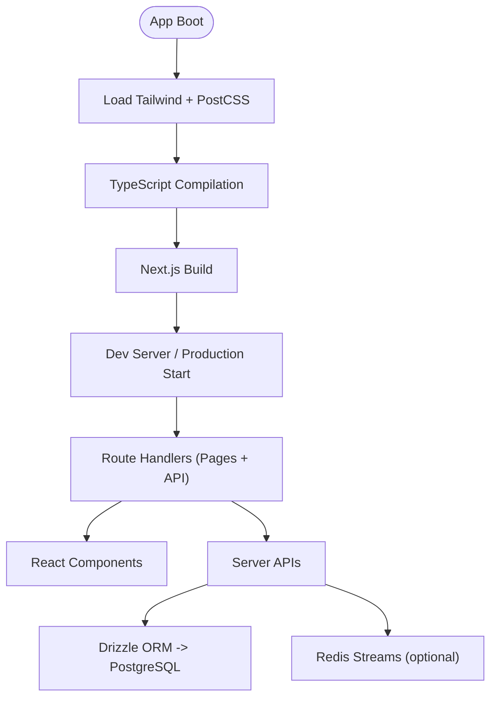

**Diagram sources**
- [package.json:14-45](file://package.json#L14-L45)
- [postcss.config.mjs:1-8](file://postcss.config.mjs#L1-L8)
- [tsconfig.json:1-43](file://tsconfig.json#L1-L43)
- [drizzle.config.json:1-8](file://drizzle.config.json#L1-L8)

**Section sources**
- [package.json:14-45](file://package.json#L14-L45)
- [tsconfig.json:1-43](file://tsconfig.json#L1-L43)
- [postcss.config.mjs:1-8](file://postcss.config.mjs#L1-L8)

### Backend Microservice (Python FastAPI)
- FastAPI exposes REST endpoints for reception, scheduling, clinical workflow, equipment, inventory, reporting, and analytics.
- Uses SQLAlchemy for database access and httpx for HTTP calls to Orthanc.
- Provides health check and structured error handling.

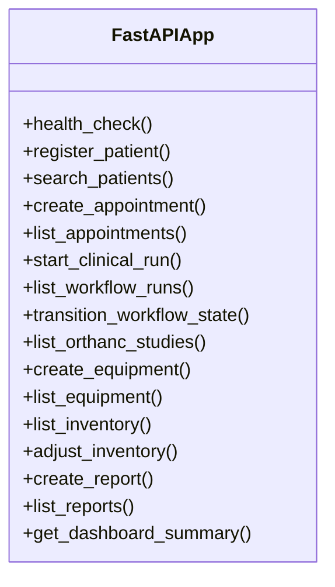

**Diagram sources**
- [backend/app/main.py:1-325](file://backend/app/main.py#L1-L325)

**Section sources**
- [backend/app/main.py:1-325](file://backend/app/main.py#L1-L325)
- [backend/requirements.txt:1-17](file://backend/requirements.txt#L1-L17)

### Database Layer (PostgreSQL with Drizzle ORM)
- Drizzle ORM schema defines comprehensive tables for patients, referrals, appointments, workflow studies, equipment, inventory, reports, finance, admin, AI-assisted reporting, knowledge documents, bookmarks, annotations, events, and notifications.
- Module-scoped schemas initialized via SQL script ensure separation of concerns and clear boundaries between domains.

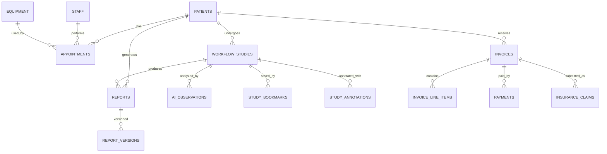

**Diagram sources**
- [src/db/schema.ts:17-468](file://src/db/schema.ts#L17-L468)
- [docker/postgres/init-schemas.sql:1-135](file://docker/postgres/init-schemas.sql#L1-L135)

**Section sources**
- [src/db/schema.ts:1-468](file://src/db/schema.ts#L1-L468)
- [docker/postgres/init-schemas.sql:1-135](file://docker/postgres/init-schemas.sql#L1-L135)
- [drizzle.config.json:1-8](file://drizzle.config.json#L1-L8)

### Authentication (Keycloak OIDC)
- OIDC discovery retrieves Keycloak endpoints; authorization flow redirects to Keycloak and exchanges code for tokens.
- ID tokens are verified against JWKS; roles extracted from realm and client scopes; HS256 session cookie issued server-side.
- Logout clears local session and optionally redirects to Keycloak end-session endpoint.

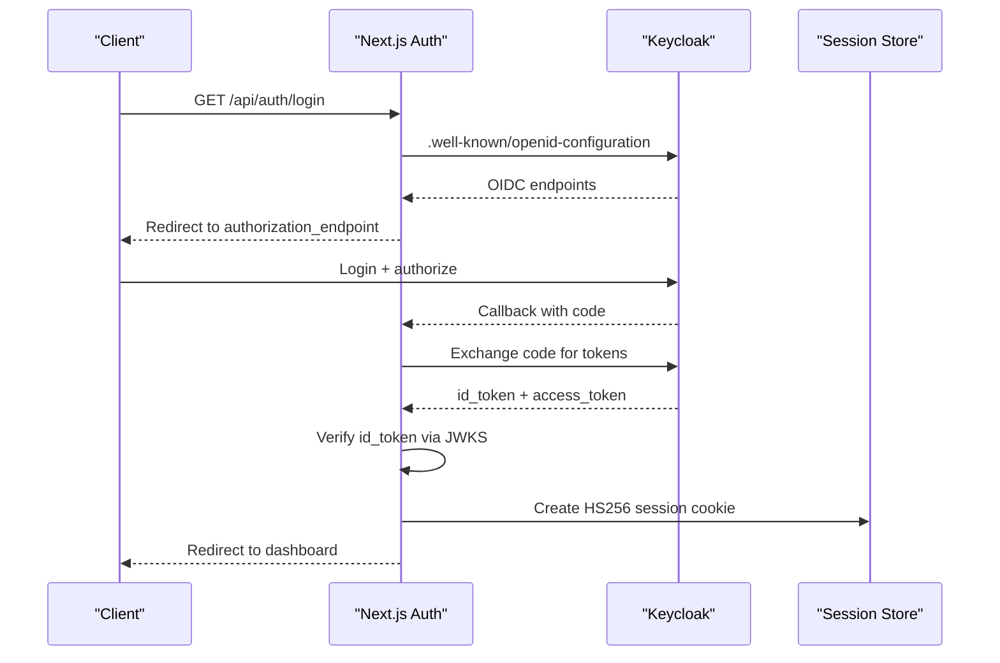

**Diagram sources**
- [src/lib/auth/oidc.ts:1-95](file://src/lib/auth/oidc.ts#L1-L95)
- [src/app/api/auth/login/route.ts:1-30](file://src/app/api/auth/login/route.ts#L1-L30)
- [src/app/api/auth/callback/route.ts:1-44](file://src/app/api/auth/callback/route.ts#L1-L44)
- [src/app/api/auth/logout/route.ts:1-30](file://src/app/api/auth/logout/route.ts#L1-L30)

**Section sources**
- [src/lib/auth/oidc.ts:1-95](file://src/lib/auth/oidc.ts#L1-L95)
- [src/app/api/auth/login/route.ts:1-30](file://src/app/api/auth/login/route.ts#L1-L30)
- [src/app/api/auth/callback/route.ts:1-44](file://src/app/api/auth/callback/route.ts#L1-L44)
- [src/app/api/auth/logout/route.ts:1-30](file://src/app/api/auth/logout/route.ts#L1-L30)

### Event Bus (Redis Streams + PostgreSQL)
- publishEvent writes to Redis Stream geraldos:events (capped at 10k entries) and persists to event_log table for durability.
- SSE endpoint streams recent events to clients every ~5 seconds, falling back to polling event_log if Redis is unreachable.

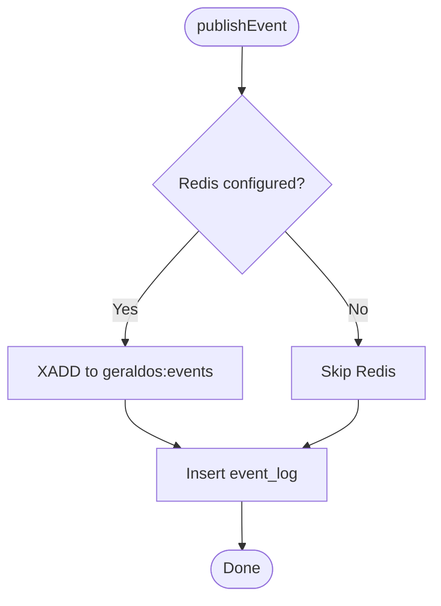

**Diagram sources**
- [src/lib/events.ts:1-147](file://src/lib/events.ts#L1-L147)
- [src/app/api/events/stream/route.ts:1-93](file://src/app/api/events/stream/route.ts#L1-L93)

**Section sources**
- [src/lib/events.ts:1-147](file://src/lib/events.ts#L1-L147)
- [src/app/api/events/stream/route.ts:1-93](file://src/app/api/events/stream/route.ts#L1-L93)

### Imaging Integrations (Orthanc PACS + OHIF)
- Orthanc configured with DICOMweb, authentication, and worklist plugins; GeraldOS proxies DICOMweb traffic to keep credentials server-side.
- OHIF viewer configured to use GeraldOS-proxied wado/qido/stow roots, ensuring same-origin security and no CORS issues.

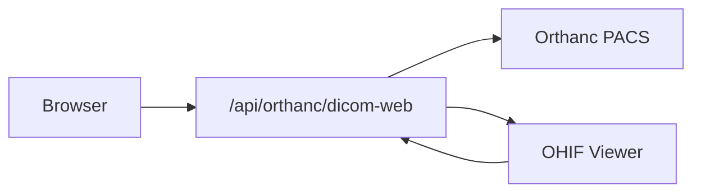

**Diagram sources**
- [services/orthanc.json:1-16](file://services/orthanc.json#L1-L16)
- [ohif-config/app-config.js:1-49](file://ohif-config/app-config.js#L1-L49)

**Section sources**
- [services/orthanc.json:1-16](file://services/orthanc.json#L1-L16)
- [ohif-config/app-config.js:1-49](file://ohif-config/app-config.js#L1-L49)

### Object Storage (MinIO)
- Presigned upload URLs generated server-side for secure direct uploads to MinIO buckets.
- Status endpoint lists buckets and ensures default bucket exists; errors return appropriate status codes.

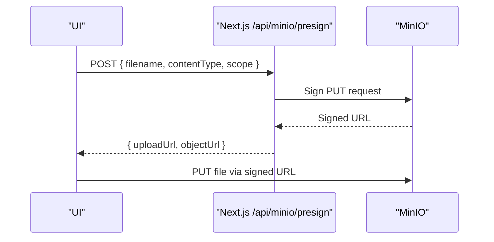

**Diagram sources**
- [src/lib/integrations/minio.ts:1-59](file://src/lib/integrations/minio.ts#L1-L59)
- [src/app/api/minio/presign/route.ts:1-28](file://src/app/api/minio/presign/route.ts#L1-L28)
- [src/app/api/minio/status/route.ts:1-23](file://src/app/api/minio/status/route.ts#L1-L23)

**Section sources**
- [src/lib/integrations/minio.ts:1-59](file://src/lib/integrations/minio.ts#L1-L59)
- [src/app/api/minio/presign/route.ts:1-28](file://src/app/api/minio/presign/route.ts#L1-L28)
- [src/app/api/minio/status/route.ts:1-23](file://src/app/api/minio/status/route.ts#L1-L23)

### AI Agents (LangGraph)
- Multi-agent graph routes queries to specialized agents (executive, reception, scheduling, equipment, inventory, workflow).
- Graph compiled and served by LangGraph Platform runtime; integrates with Redis and PostgreSQL for state persistence.

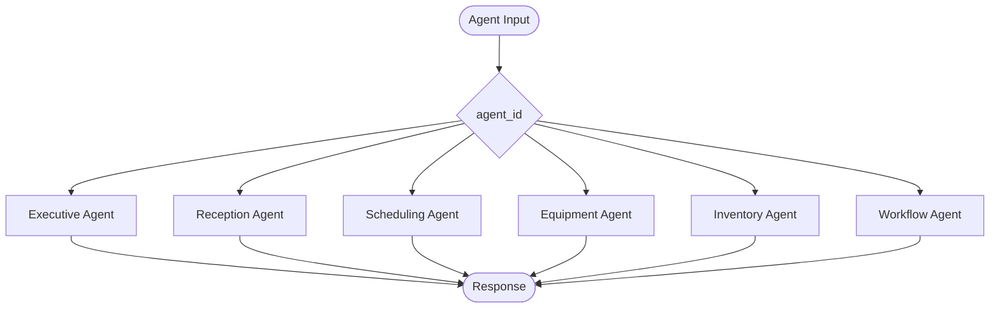

**Diagram sources**
- [services/langgraph_agent.py:1-35](file://services/langgraph_agent.py#L1-L35)

**Section sources**
- [services/langgraph_agent.py:1-35](file://services/langgraph_agent.py#L1-L35)

## Dependency Analysis
- Frontend depends on Next.js, React, TypeScript, Tailwind CSS, Radix UI, TanStack libraries, and Drizzle ORM client.
- Backend FastAPI depends on SQLAlchemy, httpx, redis, minio, jose, passlib, langgraph, and related packages.
- Docker Compose coordinates service startup order and health checks; HAPI FHIR depends on PostgreSQL; LangGraph depends on Redis and PostgreSQL.

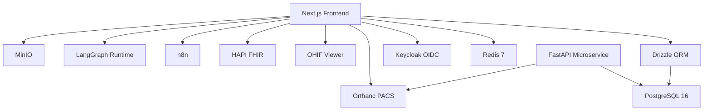

**Diagram sources**
- [docker-compose.yml:1-118](file://docker-compose.yml#L1-L118)
- [package.json:14-45](file://package.json#L14-L45)
- [backend/requirements.txt:1-17](file://backend/requirements.txt#L1-L17)

**Section sources**
- [docker-compose.yml:1-118](file://docker-compose.yml#L1-L118)
- [package.json:14-45](file://package.json#L14-L45)
- [backend/requirements.txt:1-17](file://backend/requirements.txt#L1-L17)

## Performance Considerations
- Use Redis Streams for high-throughput event publishing; cap stream length to control memory usage.
- Implement connection timeouts and retry strategies for external services (e.g., ioredis connectTimeout, AbortSignal timeouts).
- Prefer server-side proxies for sensitive integrations (Orthanc, MinIO) to avoid exposing credentials and reduce client overhead.
- Leverage Drizzle ORM for efficient query composition and type-safe migrations.
- Keep SSE polling intervals reasonable (e.g., 5 seconds) to balance latency and load.

[No sources needed since this section provides general guidance]

## Troubleshooting Guide
- Authentication failures:
  - Ensure KEYCLOAK_URL is configured; otherwise, dev mode may be used.
  - Validate OIDC discovery and JWKS endpoints; check network reachability and CORS settings.
- Event streaming issues:
  - If Redis is unreachable, events still persist to event_log; verify SSE endpoint returns keepalive comments.
  - Confirm Last-Event-ID handling and event ordering.
- Storage problems:
  - MinIO status endpoint returns not_configured or unreachable; verify endpoint, credentials, and bucket existence.
  - Presigned upload failures indicate connectivity or signature issues; check timeouts and permissions.
- PACS integration:
  - Orthanc health check should respond; verify DICOMweb plugin enabled and credentials configured.
  - OHIF viewer must point to GeraldOS-proxied DICOMweb endpoints to avoid CORS.

**Section sources**
- [src/lib/auth/oidc.ts:1-95](file://src/lib/auth/oidc.ts#L1-L95)
- [src/app/api/auth/login/route.ts:1-30](file://src/app/api/auth/login/route.ts#L1-L30)
- [src/lib/events.ts:1-147](file://src/lib/events.ts#L1-L147)
- [src/app/api/events/stream/route.ts:1-93](file://src/app/api/events/stream/route.ts#L1-L93)
- [src/lib/integrations/minio.ts:1-59](file://src/lib/integrations/minio.ts#L1-L59)
- [src/app/api/minio/status/route.ts:1-23](file://src/app/api/minio/status/route.ts#L1-L23)
- [services/orthanc.json:1-16](file://services/orthanc.json#L1-L16)
- [ohif-config/app-config.js:1-49](file://ohif-config/app-config.js#L1-L49)

## Conclusion
GeraldOS combines a robust Next.js frontend, a modular FastAPI backend, PostgreSQL with Drizzle ORM, and Redis for event-driven workflows. It integrates industry-standard services (Orthanc, OHIF, Keycloak, HAPI FHIR, n8n, LangGraph, MinIO) through server-side proxies and APIs to maintain security and performance. The architecture supports scalable operations, real-time updates, and AI-assisted workflows while providing clear migration paths for technology updates.

[No sources needed since this section summarizes without analyzing specific files]

## Appendices

### Version Compatibility Matrix
- Frontend: Next.js 16, React 19, TypeScript 5.9, Tailwind CSS 4.1, Radix UI latest, TanStack Query/Table latest, Drizzle ORM 0.45.x.
- Backend: FastAPI 0.110, Uvicorn 0.28, SQLAlchemy 2.0, Pydantic 2.6, Redis 5.0, MinIO 7.2, Jose 3.3, LangGraph 0.0.26, LangChain Core 0.1.30.
- Infrastructure: PostgreSQL 16, Redis 7, Orthanc latest, OHIF latest, Keycloak latest, HAPI FHIR latest, n8n latest, LangGraph Platform latest.

**Section sources**
- [package.json:14-45](file://package.json#L14-L45)
- [backend/requirements.txt:1-17](file://backend/requirements.txt#L1-L17)
- [docker-compose.yml:1-118](file://docker-compose.yml#L1-L118)

### Migration Strategies for Technology Updates
- Database schema changes:
  - Update Drizzle schema and run drizzle-kit push; review generated SQL migrations before applying in production.
  - Maintain backward compatibility by adding columns with defaults and deprecating fields gradually.
- Service upgrades:
  - Test major version upgrades in staging; validate health checks and dependency contracts (e.g., Orthanc DICOMweb, Keycloak OIDC endpoints).
  - Use feature flags or environment toggles to enable new behaviors incrementally.
- Event bus evolution:
  - Introduce new event types with versioning; ensure consumers can handle unknown fields gracefully.
  - Retain Redis Streams for performance while keeping event_log as source of truth for audits.
- Authentication updates:
  - Rotate JWKS keys and update issuer/client configurations; test OIDC discovery and token exchange flows.
  - Validate role mappings and session cookie policies during transitions.

**Section sources**
- [drizzle.config.json:1-8](file://drizzle.config.json#L1-L8)
- [src/db/schema.ts:1-468](file://src/db/schema.ts#L1-L468)
- [docker-compose.yml:1-118](file://docker-compose.yml#L1-L118)
- [src/lib/auth/oidc.ts:1-95](file://src/lib/auth/oidc.ts#L1-L95)
- [src/lib/events.ts:1-147](file://src/lib/events.ts#L1-L147)