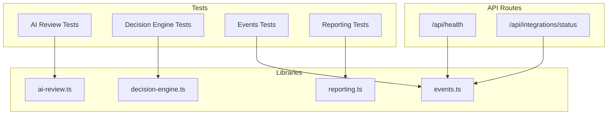
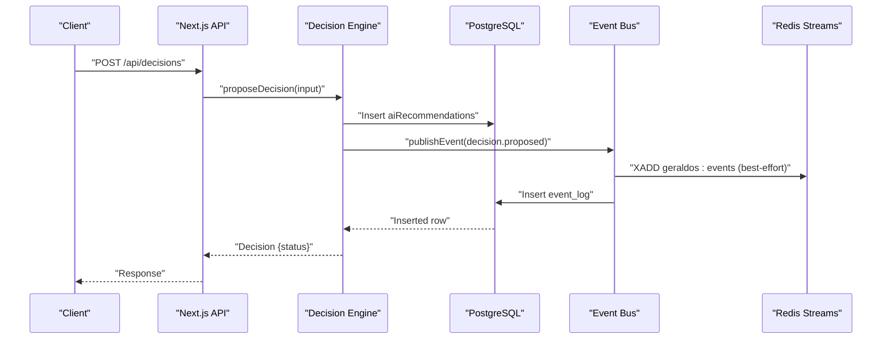
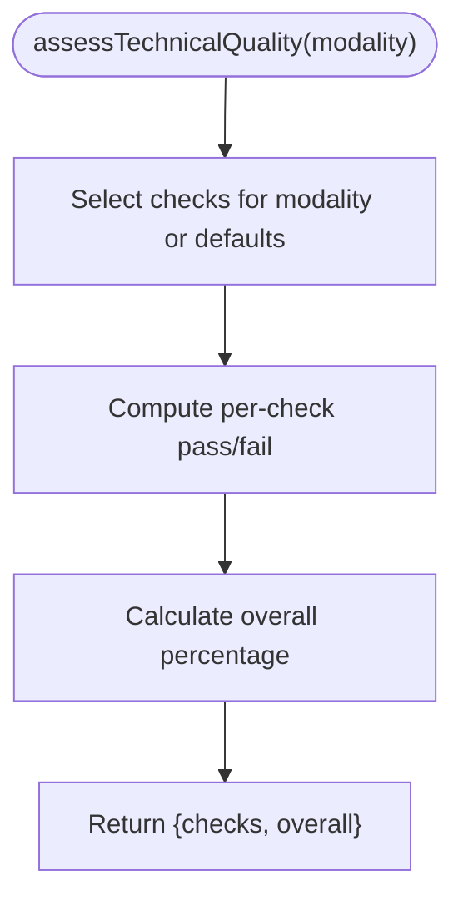
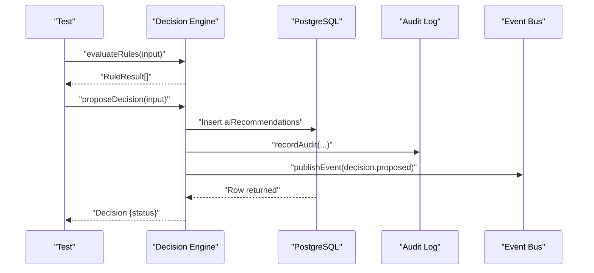
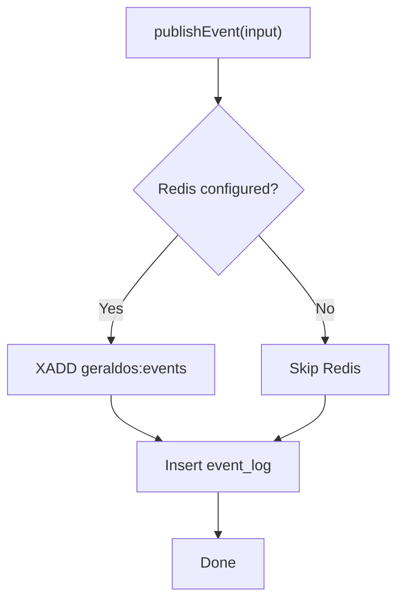
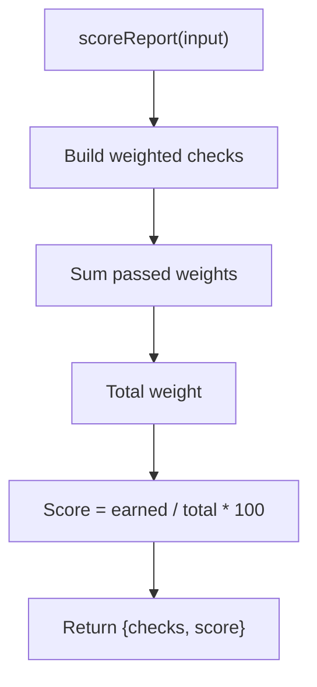
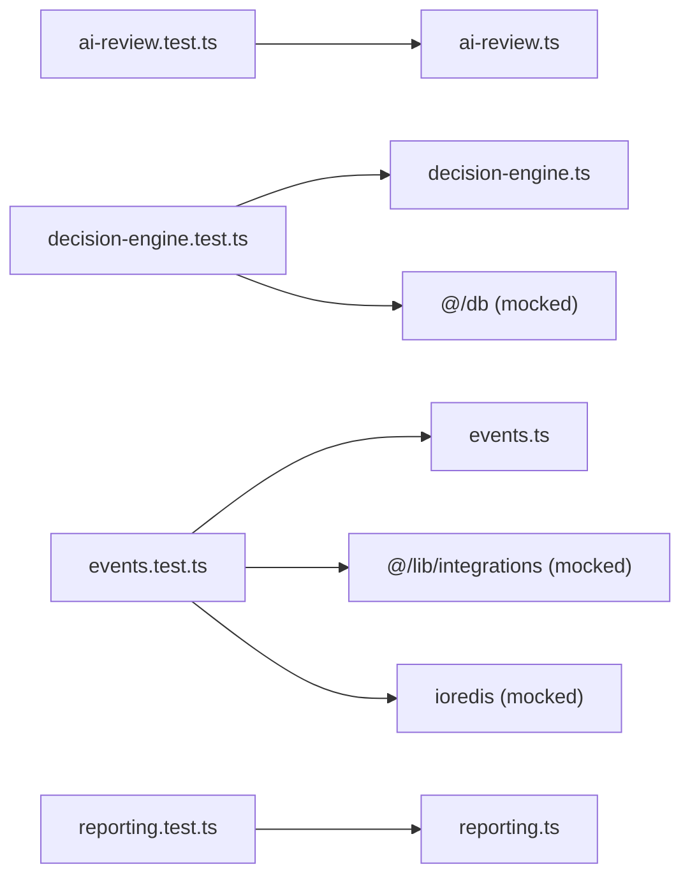

# Testing Strategy

<cite>
**Referenced Files in This Document**
- [ai-review.test.ts](file://__tests__\lib\ai-review.test.ts)
- [decision-engine.test.ts](file://__tests__\lib\decision-engine.test.ts)
- [events.test.ts](file://__tests__\lib\events.test.ts)
- [reporting.test.ts](file://__tests__\lib\reporting.test.ts)
- [vitest.config.ts](file://vitest.config.ts)
- [package.json](file://package.json)
- [ai-review.ts](file://src\lib\ai-review.ts)
- [decision-engine.ts](file://src\lib\decision-engine.ts)
- [events.ts](file://src\lib\events.ts)
- [reporting.ts](file://src\lib\reporting.ts)
- [health route.ts](file://src\app\api\health\route.ts)
- [integrations status route.ts](file://src\app\api\integrations\status\route.ts)
</cite>

## Table of Contents
1. Introduction
2. Project Structure
3. Core Components
4. Architecture Overview
5. Detailed Component Analysis
6. Dependency Analysis
7. Performance Considerations
8. Troubleshooting Guide
9. Conclusion

## Introduction
This document defines the testing strategy for GeraldOS, a healthcare AI platform that provides decision support for imaging workflows. It outlines a testing pyramid approach: unit tests for business logic, integration tests for API endpoints and external services, and end-to-end tests for user workflows. It also covers test organization, mocking strategies for databases and external systems, continuous integration setup, and domain-specific testing for AI components, decision engine validation, event processing, and reporting. Finally, it addresses performance testing, load testing scenarios, regression procedures, and best practices for healthcare applications including data privacy and compliance validation.

## Project Structure
GeraldOS uses Vitest for unit and integration tests with a Node environment. Tests are colocated under __tests__/lib and target core libraries such as AI review, decision engine, events, and reporting. The Next.js application exposes API routes for health checks and integration status, which can be used for integration and end-to-end testing.

**Diagram sources**
- [ai-review.test.ts:1-141](file://__tests__\lib\ai-review.test.ts#L1-L141)
- [decision-engine.test.ts:1-152](file://__tests__\lib\decision-engine.test.ts#L1-L152)
- [events.test.ts:1-108](file://__tests__\lib\events.test.ts#L1-L108)
- [reporting.test.ts:1-167](file://__tests__\lib\reporting.test.ts#L1-L167)
- [ai-review.ts:1-221](file://src\lib\ai-review.ts#L1-L221)
- [decision-engine.ts:1-245](file://src\lib\decision-engine.ts#L1-L245)
- [events.ts:1-158](file://src\lib\events.ts#L1-L158)
- [reporting.ts:1-326](file://src\lib\reporting.ts#L1-L326)
- [health route.ts:1-14](file://src\app\api\health\route.ts#L1-L14)
- [integrations status route.ts:1-43](file://src\app\api\integrations\status\route.ts#L1-L43)

**Section sources**
- [vitest.config.ts:1-17](file://vitest.config.ts#L1-L17)
- [package.json:1-62](file://package.json#L1-L62)

## Core Components
The testing strategy focuses on four core areas:

- AI Review Assistant: Validates modality coverage, technical quality assessment, candidate generation, and safety boundaries (no auto-acceptance, no definitive diagnoses).
- Decision Engine: Validates rule evaluation, state transitions, approval/rejection flows, and execution through whitelisted actions.
- Event Bus: Validates publishing to Redis Streams and durable persistence to the database, graceful handling when Redis is unavailable, listing and counting events.
- Reporting Assistant: Validates template selection, draft preparation, quality scoring, measurement extraction, critical finding detection, and terminology normalization.

These components are tested via unit tests that mock external dependencies (database, integrations, Redis) to ensure deterministic, fast, and isolated runs.

**Section sources**
- [ai-review.test.ts:1-141](file://__tests__\lib\ai-review.test.ts#L1-L141)
- [decision-engine.test.ts:1-152](file://__tests__\lib\decision-engine.test.ts#L1-L152)
- [events.test.ts:1-108](file://__tests__\lib\events.test.ts#L1-L108)
- [reporting.test.ts:1-167](file://__tests__\lib\reporting.test.ts#L1-L167)

## Architecture Overview
The system follows an event-driven architecture with strict governance over AI actions. AI-generated recommendations pass through business rules, require human approval, and execute only via whitelisted actions. Events are published to Redis Streams (when configured) and always persisted to the database for auditability.

**Diagram sources**
- [decision-engine.ts:92-130](file://src\lib\decision-engine.ts#L92-L130)
- [events.ts:102-131](file://src\lib\events.ts#L102-L131)

## Detailed Component Analysis

### AI Review Assistant Testing
- Coverage: Ensures all modalities are supported and each has weighted technical checks summing to 100.
- Quality Assessment: Verifies per-check pass/fail and overall score bounds.
- Candidate Generation: Confirms presence of finding, normal, and technical candidates; respects body part hints; ensures advisory language and moderate confidence; validates differentials and literature references.
- Safety Boundaries: Enforces no auto-acceptance and no definitive diagnosis language.

**Diagram sources**
- [ai-review.ts:91-103](file://src\lib\ai-review.ts#L91-L103)

**Section sources**
- [ai-review.test.ts:11-140](file://__tests__\lib\ai-review.test.ts#L11-L140)
- [ai-review.ts:21-117](file://src\lib\ai-review.ts#L21-L117)
- [ai-review.ts:168-221](file://src\lib\ai-review.ts#L168-L221)

### Decision Engine Testing
- Rule Evaluation: Validates blocking of report finalization by agents, prevention of autonomous diagnosis, and STAT priority restrictions to allowed modules.
- State Management: Confirms proposed vs validated states based on rule outcomes.
- Approval/Rejection/Execution: Ensures explicit human approval before execution and proper audit/event emission.

**Diagram sources**
- [decision-engine.ts:46-89](file://src\lib\decision-engine.ts#L46-L89)
- [decision-engine.ts:92-130](file://src\lib\decision-engine.ts#L92-L130)

**Section sources**
- [decision-engine.test.ts:58-150](file://__tests__\lib\decision-engine.test.ts#L58-L150)
- [decision-engine.ts:142-169](file://src\lib\decision-engine.ts#L142-L169)
- [decision-engine.ts:212-235](file://src\lib\decision-engine.ts#L212-L235)

### Event Bus Testing
- Publishing: Verifies event insertion into the database and best-effort Redis Stream writes.
- Resilience: Confirms graceful behavior when Redis is unavailable.
- Querying: Validates list and count operations with optional filtering.

**Diagram sources**
- [events.ts:72-99](file://src\lib\events.ts#L72-L99)
- [events.ts:102-131](file://src\lib\events.ts#L102-L131)

**Section sources**
- [events.test.ts:49-106](file://__tests__\lib\events.test.ts#L49-L106)
- [events.ts:18-60](file://src\lib\events.ts#L18-L60)
- [events.ts:134-157](file://src\lib\events.ts#L134-L157)

### Reporting Assistant Testing
- Templates: Ensures built-in templates exist for major modalities and contain required fields.
- Draft Preparation: Validates default template fallback, modality matching, specific template selection, and body part hints.
- Quality Scoring: Checks content thresholds, placeholder detection, terminology consistency, and recommendation presence.
- Utilities: Verifies measurement extraction, critical findings detection, and terminology drift suggestions.

**Diagram sources**
- [reporting.ts:273-290](file://src\lib\reporting.ts#L273-L290)

**Section sources**
- [reporting.test.ts:15-166](file://__tests__\lib\reporting.test.ts#L15-L166)
- [reporting.ts:24-173](file://src\lib\reporting.ts#L24-L173)
- [reporting.ts:233-256](file://src\lib\reporting.ts#L233-L256)
- [reporting.ts:292-325](file://src\lib\reporting.ts#L292-L325)

## Dependency Analysis
The tests rely on Vitest’s mocking capabilities to isolate units from external systems:

- Database: Mocked via vi.mock("@/db") to simulate Drizzle ORM queries and mutations.
- Integrations: Mocked via vi.mock("@/lib/integrations") to control configuration flags like Redis URL.
- Redis: Mocked via vi.mock("ioredis") to simulate stream operations without a live instance.

**Diagram sources**
- [decision-engine.test.ts:3-47](file://__tests__\lib\decision-engine.test.ts#L3-L47)
- [events.test.ts:3-45](file://__tests__\lib\events.test.ts#L3-L45)

**Section sources**
- [decision-engine.test.ts:3-47](file://__tests__\lib\decision-engine.test.ts#L3-L47)
- [events.test.ts:3-45](file://__tests__\lib\events.test.ts#L3-L45)

## Performance Considerations
- Unit tests should remain fast and deterministic by mocking slow dependencies (database, network).
- Integration tests for API routes should include latency assertions for health checks and integration status endpoints to detect regressions in service responsiveness.
- Use small, focused datasets in tests to minimize overhead while validating correctness.
- For event bus tests, verify both Redis path and fallback path to ensure resilience does not degrade performance.

[No sources needed since this section provides general guidance]

## Troubleshooting Guide
Common issues and resolutions:

- Redis unavailability: The event bus continues to persist events to the database; tests confirm graceful handling when Redis is not configured or unreachable.
- Database connectivity: Health endpoint returns a clear status; integration status endpoint reports PostgreSQL reachability and latency.
- Rule failures: Decision engine sets appropriate statuses (proposed vs validated) and emits audit events; tests assert expected rule outcomes.

**Section sources**
- [events.test.ts:66-75](file://__tests__\lib\events.test.ts#L66-L75)
- [health route.ts:6-12](file://src\app\api\health\route.ts#L6-L12)
- [integrations status route.ts:8-41](file://src\app\api\integrations\status\route.ts#L8-L41)

## Conclusion
GeraldOS employs a robust testing strategy centered on unit tests for business logic, integration tests for APIs and external services, and end-to-end tests for user workflows. The existing test suite validates AI decision support boundaries, decision engine governance, event bus resilience, and reporting quality. By continuing to expand coverage across API routes and adding performance and load tests, the platform will maintain high reliability and compliance in healthcare environments.

[No sources needed since this section summarizes without analyzing specific files]