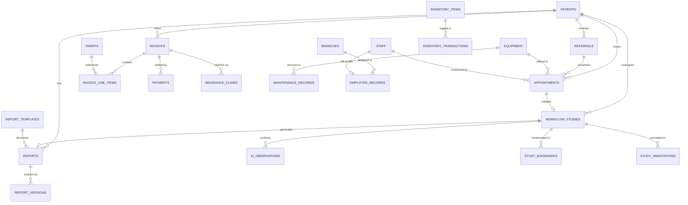

# GeraldOS Database & Entity Map

This document outlines the PostgreSQL database architecture managed via Drizzle ORM in `src/db/schema.ts`, including entity relationships, indices, constraints, and audit trails.

---

## 1. Entity Relationship Diagram

---

## 2. Table Specifications

### 2.1 Core Clinical Entities

#### `patients`
- Primary Key: `id` (UUID, default random).
- Columns: `mrn` (unique varchar 20), `first_name`, `last_name`, `date_of_birth` (date), `gender`, `phone`, `email`, `address`, `insurance_provider`, `insurance_policy_number`, `emergency_contact_name`, `emergency_contact_phone`, `consent_signed` (boolean), `status` (default "active"), `created_at`, `updated_at`.

#### `referrals`
- Primary Key: `id` (UUID).
- Foreign Keys: `patient_id` → `patients(id)`.
- Columns: `referring_physician`, `referring_facility`, `clinical_indication`, `requested_procedure`, `priority` (routine, urgent, stat), `status` (pending, scheduled, completed), `notes`.

#### `appointments`
- Primary Key: `id` (UUID).
- Foreign Keys: `patient_id` → `patients(id)`, `referral_id` → `referrals(id)`, `equipment_id` → `equipment(id)`, `radiographer_id` → `staff(id)`.
- Columns: `scheduled_date` (date), `scheduled_time` (time), `duration` (integer, mins), `modality`, `procedure`, `priority`, `status`, `checked_in` (boolean), `checked_in_at` (timestamp).

#### `workflow_studies`
- Primary Key: `id` (UUID).
- Foreign Keys: `appointment_id` → `appointments(id)`, `patient_id` → `patients(id)`, `radiologist_id` → `staff(id)`.
- Columns: `accession_number` (unique varchar 50), `study_instance_uid` (varchar 128), `modality` (XR, CT, MRI, US, MG, DX, NM, etc.), `procedure`, `body_part`, `stage` (`referral`, `checked_in`, `protocolling`, `acquisition`, `qa_review`, `reporting`, `ready_to_sign`, `completed`), `priority`, `started_at`, `completed_at`.

---

### 2.2 Reporting & AI Intelligence Entities

#### `reports`
- Primary Key: `id` (UUID).
- Foreign Keys: `study_id` → `workflow_studies(id)`, `patient_id` → `patients(id)`, `radiologist_id` → `staff(id)`.
- Columns: `template_name`, `findings` (text), `impression` (text), `recommendation` (text), `status` (`draft`, `preliminary`, `final`, `addended`), `signed_at`.

#### `report_templates`
- Primary Key: `id` (UUID).
- Columns: `name`, `modality`, `description`, `sections` (jsonb), `checklist` (jsonb), `is_system` (boolean), `active` (boolean).

#### `report_versions`
- Primary Key: `id` (UUID).
- Foreign Keys: `report_id` → `reports(id)`.
- Columns: `version` (integer), `findings`, `impression`, `recommendation`, `status`, `quality_score` (integer 0-100), `ai_assisted` (boolean), `changed_by` (varchar 100).

#### `ai_observations`
- Primary Key: `id` (UUID).
- Foreign Keys: `study_id` → `workflow_studies(id)`.
- Columns: `orthanc_study_id`, `modality`, `region`, `category` (`finding`, `normal`, `technical`, `critical`), `description`, `confidence` (numeric 5,2), `bounding_box` (jsonb), `heatmap_ref`, `suggested_differential` (jsonb), `literature_refs` (jsonb), `similar_case_ids` (jsonb), `status` (`pending`, `accepted`, `rejected`), `reviewed_by`, `reviewed_at`, `model_version`.

#### `ai_recommendations`
- Primary Key: `id` (UUID).
- Columns: `agent`, `recommendation`, `rationale`, `priority`, `status` (`proposed`, `validated`, `approved`, `rejected`, `executed`, `failed`), `rule_results` (jsonb), `validation_results` (jsonb), `target_module`, `target_action`, `target_payload` (jsonb), `requested_by`, `approved_by`, `approved_at`, `executed_at`, `audit_ref`.

#### `knowledge_documents`
- Primary Key: `id` (UUID).
- Columns: `title`, `category` (SOP, Protocol, Manual, Policy), `doc_type`, `summary`, `content`, `tags` (jsonb), `version`, `author`, `status` (`draft`, `published`, `archived`), `approved_by`.

---

### 2.3 Radiologist Workspace Entities

#### `study_bookmarks`
- Primary Key: `id` (UUID).
- Foreign Keys: `study_id` → `workflow_studies(id)`.
- Columns: `user_id`, `orthanc_study_id`, `label`, `note`.

#### `study_annotations`
- Primary Key: `id` (UUID).
- Foreign Keys: `study_id` → `workflow_studies(id)`.
- Columns: `orthanc_study_id`, `series_instance_uid`, `tool` (`length`, `angle`, `area`, `arrow`, `text`), `label`, `data` (jsonb), `created_by`.

---

### 2.4 Finance & Operations Entities

#### `tariffs`
- Primary Key: `id` (UUID).
- Columns: `code` (unique), `description`, `modality`, `cash_price` (numeric 10,2), `medical_aid_price` (numeric 10,2), `nappi_code`, `active` (boolean).

#### `invoices`
- Primary Key: `id` (UUID).
- Foreign Keys: `patient_id` → `patients(id)`, `study_id` → `workflow_studies(id)`, `appointment_id` → `appointments(id)`.
- Columns: `invoice_number` (unique), `billing_type` (cash, medical_aid), `insurance_provider`, `insurance_policy_number`, `subtotal` (numeric 12,2), `tax_amount` (numeric 12,2, 14% VAT), `total_amount` (numeric 12,2), `amount_paid` (numeric 12,2), `status` (`draft`, `issued`, `partially_paid`, `paid`, `cancelled`), `issue_date`, `due_date`, `notes`.

#### `invoice_line_items`
- Primary Key: `id` (UUID).
- Foreign Keys: `invoice_id` → `invoices(id)`, `tariff_id` → `tariffs(id)`.
- Columns: `description`, `quantity` (integer), `unit_price` (numeric 10,2), `line_total` (numeric 12,2).

#### `payments`
- Primary Key: `id` (UUID).
- Foreign Keys: `invoice_id` → `invoices(id)`, `patient_id` → `patients(id)`.
- Columns: `receipt_number` (unique), `amount` (numeric 12,2), `method` (`cash`, `card`, `eft`, `medical_aid`), `reference`, `received_by`, `received_at`.

#### `insurance_claims`
- Primary Key: `id` (UUID).
- Foreign Keys: `invoice_id` → `invoices(id)`, `patient_id` → `patients(id)`.
- Columns: `claim_number` (unique), `medical_aid` (BOMAID, BPOMAS, Pula, etc.), `membership_number`, `amount_claimed`, `amount_approved`, `status` (`submitted`, `adjudicating`, `approved`, `rejected`, `paid`), `rejection_reason`.

#### `expenses`
- Primary Key: `id` (UUID).
- Columns: `category`, `description`, `amount`, `vendor`, `branch_id`, `status`, `incurred_date`, `approved_by`.

---

### 2.5 Infrastructure & Audit Entities

#### `event_log`
- Primary Key: `id` (Serial).
- Columns: `event_type`, `aggregate`, `aggregate_id`, `payload` (jsonb), `source`, `occurred_at`.

#### `audit_log`
- Primary Key: `id` (Serial).
- Columns: `user_id`, `action`, `module`, `entity_type`, `entity_id`, `details` (jsonb), `ip_address`, `created_at`.

#### `notifications`
- Primary Key: `id` (UUID).
- Columns: `user_id` (default "all"), `title`, `body`, `type` (`info`, `alert`, `warning`, `success`), `severity`, `link`, `read` (boolean), `created_at`.
